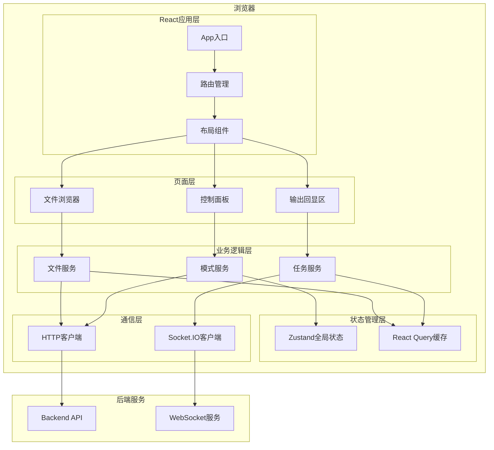

# Claude Code Harness - 前端架构设计文档

## 文档信息
- **项目名称**: Claude Code Harness Frontend
- **架构版本**: 1.0
- **创建日期**: 2024-01-20
- **最后更新**: 2024-01-20

---

## 1. 架构概述

### 1.1 项目定位
Claude Code Harness 前端是一个基于Web的自动化开发平台界面，提供可视化的项目管理、任务执行监控、实时输出回显等功能。

### 1.2 核心目标
- **高性能**: 支持大量文件展示、实时流式输出
- **高可用**: WebSocket稳定连接、断线重连
- **高交互**: 流畅的用户体验、实时进度反馈
- **高扩展**: 模块化设计、易于扩展新模式

### 1.3 技术特点
- 前后端分离架构
- WebSocket实时通信
- 组件化开发
- 状态集中管理
- TypeScript类型安全

---

## 2. 技术栈选型

### 2.1 核心框架
**选择: React 18+ with TypeScript**

**理由**:
- **生态成熟**: 丰富的组件库和工具链
- **性能优秀**: Fiber架构、并发渲染
- **类型安全**: 与TypeScript深度集成
- **社区活跃**: 问题解决快、资源丰富
- **Hooks强大**: 逻辑复用、状态管理便捷

**替代方案对比**:
| 框架 | 优势 | 劣势 | 评分 |
|------|------|------|------|
| React | 生态最好、性能优秀、灵活度高 | 上手稍难 | ⭐⭐⭐⭐⭐ |
| Vue 3 | 上手简单、文档友好 | 企业级生态略弱 | ⭐⭐⭐⭐ |
| Svelte | 性能最佳、代码简洁 | 生态较小、不成熟 | ⭐⭐⭐ |

### 2.2 UI组件库
**选择: Ant Design 5.x**

**理由**:
- **企业级**: 专为中后台系统设计
- **组件丰富**: 包含所需的所有组件（Tree、Table、Modal等）
- **主题定制**: 支持CSS-in-JS、主题变量
- **TypeScript**: 完整的类型定义
- **国际化**: 内置i18n支持

**关键组件使用**:
- `Tree`: 文件浏览器
- `Layout`: 三栏布局
- `Tabs`: 模式切换
- `Progress`: 任务进度
- `Button`: 操作按钮
- `Input.TextArea`: 输入框
- `Drawer/Modal`: 弹窗

### 2.3 状态管理
**选择: Zustand + React Query**

**Zustand理由**:
- **轻量级**: 仅3KB，API简洁
- **性能好**: 基于Proxy，无不必要渲染
- **无模板代码**: 不需要actions/reducers
- **TypeScript友好**: 类型推断完善
- **DevTools支持**: 调试方便

**React Query理由**:
- **服务端状态管理**: 专为异步数据设计
- **缓存策略**: 自动缓存、重新验证
- **请求去重**: 避免重复请求
- **乐观更新**: 提升用户体验
- **WebSocket集成**: 支持实时数据

**替代方案对比**:
| 方案 | 适用场景 | 评分 |
|------|----------|------|
| Zustand | 客户端状态（UI状态、模式等） | ⭐⭐⭐⭐⭐ |
| React Query | 服务端状态（任务数据、文件树等） | ⭐⭐⭐⭐⭐ |
| Redux Toolkit | 复杂状态、时间旅行调试 | ⭐⭐⭐⭐ |
| Jotai/Recoil | 原子化状态管理 | ⭐⭐⭐ |

### 2.4 路由管理
**选择: React Router v6**

**理由**:
- **标准解决方案**: React官方推荐
- **嵌套路由**: 支持复杂布局
- **懒加载**: 代码分割、按需加载
- **TypeScript**: 完整类型支持

### 2.5 代码编辑器
**选择: Monaco Editor**

**理由**:
- **VS Code内核**: 功能强大
- **语法高亮**: 支持多种语言
- **智能提示**: 代码补全
- **主题支持**: 深色/浅色模式
- **性能优秀**: 大文件支持

### 2.6 实时通信
**选择: Socket.IO Client**

**理由**:
- **可靠性**: 自动重连、心跳检测
- **兼容性**: 降级到轮询
- **事件驱动**: API简洁
- **房间支持**: 多项目隔离
- **TypeScript**: 类型定义完善

### 2.7 图表渲染
**选择: Mermaid.js**

**理由**:
- **Markdown友好**: 文本定义图表
- **图表类型丰富**: 流程图、甘特图、序列图
- **DAG支持**: 适合依赖关系可视化
- **主题定制**: 支持样式自定义

### 2.8 构建工具
**选择: Vite**

**理由**:
- **极速冷启动**: ESM原生支持
- **热更新快**: 按需编译
- **插件丰富**: React、TypeScript开箱即用
- **优化构建**: Rollup生产构建
- **现代化**: 对标Webpack 5+

### 2.9 CSS方案
**选择: TailwindCSS + CSS Modules**

**TailwindCSS理由**:
- **原子化CSS**: 快速开发
- **响应式**: 移动优先
- **主题系统**: 设计令牌
- **体积小**: Tree-shaking优化

**CSS Modules理由**:
- **局部作用域**: 避免样式冲突
- **与Tailwind互补**: 复杂组件使用

### 2.10 开发工具
- **ESLint + Prettier**: 代码规范
- **Husky + lint-staged**: Git钩子
- **TypeScript**: 类型检查
- **Vitest**: 单元测试
- **Playwright**: E2E测试

---

## 3. 系统架构

### 3.1 整体架构图



### 3.2 分层架构

```
┌─────────────────────────────────────────────┐
│            展示层 (Presentation)             │
│  - React组件                                 │
│  - UI交互                                    │
│  - 页面路由                                  │
└─────────────────┬───────────────────────────┘
                  │
┌─────────────────▼───────────────────────────┐
│           容器层 (Container)                 │
│  - 业务逻辑组装                              │
│  - 状态订阅                                  │
│  - 事件处理                                  │
└─────────────────┬───────────────────────────┘
                  │
┌─────────────────▼───────────────────────────┐
│          状态管理层 (State)                  │
│  - Zustand Store (UI状态)                   │
│  - React Query (服务端状态)                 │
│  - Context (主题、i18n)                     │
└─────────────────┬───────────────────────────┘
                  │
┌─────────────────▼───────────────────────────┐
│          服务层 (Service)                    │
│  - API调用封装                               │
│  - WebSocket管理                            │
│  - 业务逻辑                                  │
└─────────────────┬───────────────────────────┘
                  │
┌─────────────────▼───────────────────────────┐
│          通信层 (Network)                    │
│  - HTTP Client (axios)                      │
│  - WebSocket Client (Socket.IO)             │
│  - 请求拦截器                                │
└─────────────────────────────────────────────┘
```

---

## 4. 目录结构

```
frontend/
├── public/                      # 静态资源
│   ├── index.html
│   └── favicon.ico
├── src/
│   ├── main.tsx                # 应用入口
│   ├── App.tsx                 # 根组件
│   ├── vite-env.d.ts           # Vite类型声明
│   │
│   ├── assets/                 # 资源文件
│   │   ├── images/
│   │   ├── icons/
│   │   └── fonts/
│   │
│   ├── components/             # 通用组件
│   │   ├── common/             # 基础组件
│   │   │   ├── Button/
│   │   │   ├── Input/
│   │   │   └── Modal/
│   │   ├── layout/             # 布局组件
│   │   │   ├── MainLayout/
│   │   │   ├── Header/
│   │   │   └── Sidebar/
│   │   └── business/           # 业务组件
│   │       ├── FileTree/
│   │       ├── CodeEditor/
│   │       └── TaskProgress/
│   │
│   ├── pages/                  # 页面组件
│   │   ├── Dashboard/          # 主控制台
│   │   ├── ProjectView/        # 项目视图
│   │   └── Settings/           # 设置页面
│   │
│   ├── features/               # 功能模块（按功能划分）
│   │   ├── file-explorer/      # 文件浏览器
│   │   │   ├── components/
│   │   │   ├── hooks/
│   │   │   ├── services/
│   │   │   └── types.ts
│   │   ├── output-console/     # 输出控制台
│   │   │   ├── components/
│   │   │   ├── hooks/
│   │   │   └── types.ts
│   │   ├── mode-control/       # 模式控制
│   │   │   ├── components/
│   │   │   ├── hooks/
│   │   │   └── types.ts
│   │   └── task-execution/     # 任务执行
│   │       ├── components/
│   │       ├── hooks/
│   │       └── types.ts
│   │
│   ├── store/                  # 状态管理
│   │   ├── index.ts            # Store汇总
│   │   ├── useAppStore.ts      # 应用全局状态
│   │   ├── useFileStore.ts     # 文件状态
│   │   ├── useModeStore.ts     # 模式状态
│   │   └── useTaskStore.ts     # 任务状态
│   │
│   ├── services/               # 服务层
│   │   ├── api/                # HTTP API
│   │   │   ├── file.api.ts
│   │   │   ├── task.api.ts
│   │   │   └── mode.api.ts
│   │   ├── websocket/          # WebSocket
│   │   │   ├── socket.client.ts
│   │   │   └── event-handlers.ts
│   │   └── storage/            # 本地存储
│   │       └── localStorage.ts
│   │
│   ├── hooks/                  # 自定义Hooks
│   │   ├── useWebSocket.ts
│   │   ├── useFileSystem.ts
│   │   ├── useTaskExecution.ts
│   │   └── useKeyboard.ts
│   │
│   ├── utils/                  # 工具函数
│   │   ├── format.ts           # 格式化工具
│   │   ├── validation.ts       # 验证工具
│   │   ├── dag.ts              # DAG处理
│   │   └── file.ts             # 文件处理
│   │
│   ├── types/                  # 类型定义
│   │   ├── api.types.ts        # API类型
│   │   ├── file.types.ts       # 文件类型
│   │   ├── task.types.ts       # 任务类型
│   │   └── global.d.ts         # 全局类型
│   │
│   ├── constants/              # 常量
│   │   ├── routes.ts           # 路由常量
│   │   ├── modes.ts            # 模式常量
│   │   └── config.ts           # 配置常量
│   │
│   ├── styles/                 # 样式
│   │   ├── global.css          # 全局样式
│   │   ├── variables.css       # CSS变量
│   │   └── tailwind.css        # Tailwind配置
│   │
│   └── tests/                  # 测试文件
│       ├── unit/               # 单元测试
│       ├── integration/        # 集成测试
│       └── e2e/                # E2E测试
│
├── .env                        # 环境变量
├── .env.development            # 开发环境
├── .env.production             # 生产环境
├── .eslintrc.cjs               # ESLint配置
├── .prettierrc                 # Prettier配置
├── tsconfig.json               # TypeScript配置
├── tsconfig.node.json          # Node环境TS配置
├── vite.config.ts              # Vite配置
├── tailwind.config.js          # Tailwind配置
├── postcss.config.js           # PostCSS配置
├── package.json                # 项目依赖
└── README.md                   # 项目文档
```

---

## 5. 核心模块设计

### 5.1 文件浏览器模块 (File Explorer)

#### 5.1.1 功能需求
- 显示项目文件树结构
- 支持展开/折叠目录
- 文件/目录搜索过滤
- 右键菜单（新建、删除、重命名）
- 文件类型图标
- 虚拟滚动（大量文件性能优化）

#### 5.1.2 组件结构
```
file-explorer/
├── components/
│   ├── FileTree.tsx              # 文件树主组件
│   ├── FileTreeNode.tsx          # 树节点组件
│   ├── FileContextMenu.tsx       # 右键菜单
│   ├── FileSearchBar.tsx         # 搜索栏
│   └── FileIcon.tsx              # 文件图标
├── hooks/
│   ├── useFileTree.ts            # 文件树逻辑
│   ├── useFileOperations.ts      # 文件操作
│   └── useVirtualScroll.ts       # 虚拟滚动
├── services/
│   └── file.service.ts           # 文件服务
└── types.ts                      # 类型定义
```

#### 5.1.3 数据结构
```typescript
interface FileNode {
  id: string;
  name: string;
  type: 'file' | 'directory';
  path: string;
  children?: FileNode[];
  size?: number;
  modified?: Date;
  expanded?: boolean;
}

interface FileTreeState {
  root: FileNode;
  expandedKeys: Set<string>;
  selectedKey: string | null;
  searchQuery: string;
}
```

#### 5.1.4 性能优化
- **虚拟滚动**: 只渲染可见节点
- **懒加载**: 展开目录时才加载子节点
- **防抖搜索**: 300ms延迟
- **缓存**: 文件树结构缓存

### 5.2 输出回显模块 (Output Console)

#### 5.2.1 功能需求
- 实时流式输出显示
- 语法高亮
- 输出搜索
- 输出导出
- 自动滚动到底部
- 输出历史记录

#### 5.2.2 组件结构
```
output-console/
├── components/
│   ├── OutputConsole.tsx         # 输出控制台主组件
│   ├── OutputDisplay.tsx         # 输出显示区
│   ├── InputArea.tsx             # 输入区域
│   ├── OutputToolbar.tsx         # 工具栏
│   └── SyntaxHighlighter.tsx     # 语法高亮
├── hooks/
│   ├── useOutputStream.ts        # 输出流处理
│   ├── useInputHistory.ts        # 输入历史
│   └── useAutoScroll.ts          # 自动滚动
└── types.ts
```

#### 5.2.3 数据结构
```typescript
interface OutputMessage {
  id: string;
  timestamp: Date;
  type: 'stdout' | 'stderr' | 'system';
  content: string;
  format?: 'text' | 'markdown' | 'code';
  language?: string;
}

interface ConsoleState {
  messages: OutputMessage[];
  isStreaming: boolean;
  autoScroll: boolean;
  searchQuery: string;
}
```

#### 5.2.4 WebSocket集成
```typescript
// 接收输出流
socket.on('output:stream', (data: OutputMessage) => {
  addMessage(data);
  if (autoScroll) scrollToBottom();
});

// 发送Prompt
const sendPrompt = (prompt: string) => {
  socket.emit('prompt:submit', {
    mode: currentMode,
    prompt: prompt,
    timestamp: Date.now()
  });
};
```

### 5.3 模式控制模块 (Mode Control)

#### 5.3.1 功能需求
- 显示7种工作模式
- 模式切换
- 当前模式高亮
- 进度显示
- 快捷操作按钮

#### 5.3.2 组件结构
```
mode-control/
├── components/
│   ├── ModePanel.tsx             # 模式面板
│   ├── ModeButton.tsx            # 模式按钮
│   ├── ProgressBar.tsx           # 进度条
│   └── QuickActions.tsx          # 快捷操作
├── hooks/
│   ├── useModeControl.ts         # 模式控制
│   └── useProgress.ts            # 进度管理
└── types.ts
```

#### 5.3.3 模式定义
```typescript
enum WorkMode {
  PRD = 'prd',
  ARCHITECTURE = 'architecture',
  DEV_PLAN = 'dev_plan',
  TASK_GEN = 'task_gen',
  TASK_EXEC = 'task_exec',
  LOOP_TEST = 'loop_test',
  DEPLOY = 'deploy'
}

interface ModeConfig {
  id: WorkMode;
  name: string;
  description: string;
  icon: string;
  color: string;
  nextMode?: WorkMode;
  prevMode?: WorkMode;
}

interface ModeState {
  currentMode: WorkMode;
  modeHistory: WorkMode[];
  progress: {
    [key in WorkMode]?: number;
  };
}
```

### 5.4 任务执行模块 (Task Execution)

#### 5.4.1 功能需求
- DAG可视化
- 逐层执行监控
- 任务状态实时更新
- 失败处理
- 重试机制

#### 5.4.2 组件结构
```
task-execution/
├── components/
│   ├── TaskDashboard.tsx         # 任务仪表板
│   ├── DAGVisualization.tsx      # DAG可视化
│   ├── LayerProgress.tsx         # 层级进度
│   ├── TaskCard.tsx              # 任务卡片
│   └── ExecutionLog.tsx          # 执行日志
├── hooks/
│   ├── useTaskExecution.ts       # 任务执行
│   ├── useDAGParser.ts           # DAG解析
│   └── useTaskMonitor.ts         # 任务监控
└── types.ts
```

#### 5.4.3 数据结构
```typescript
interface Task {
  id: string;
  layer: number;
  sequence: number;
  name: string;
  description: string;
  dependencies: string[];
  status: 'pending' | 'running' | 'completed' | 'failed';
  startedAt?: Date;
  completedAt?: Date;
  error?: string;
  output?: string;
}

interface DAGState {
  tasks: Task[];
  layers: {
    [layer: number]: Task[];
  };
  currentLayer: number;
  totalLayers: number;
  overallProgress: number;
}
```

#### 5.4.4 实时监控
```typescript
// 监听任务状态更新
socket.on('task:status', (update: TaskStatusUpdate) => {
  updateTaskStatus(update.taskId, update.status);
});

// 监听层级完成
socket.on('layer:completed', (layer: number) => {
  markLayerCompleted(layer);
  startNextLayer(layer + 1);
});
```

---

## 6. 状态管理设计

### 6.1 Zustand Store结构

#### 6.1.1 应用全局状态
```typescript
// store/useAppStore.ts
interface AppState {
  // UI状态
  sidebarCollapsed: boolean;
  theme: 'light' | 'dark';

  // 用户状态
  user: User | null;

  // 操作
  toggleSidebar: () => void;
  setTheme: (theme: 'light' | 'dark') => void;
  setUser: (user: User | null) => void;
}

export const useAppStore = create<AppState>((set) => ({
  sidebarCollapsed: false,
  theme: 'light',
  user: null,

  toggleSidebar: () => set((state) => ({
    sidebarCollapsed: !state.sidebarCollapsed
  })),

  setTheme: (theme) => set({ theme }),
  setUser: (user) => set({ user })
}));
```

#### 6.1.2 模式状态
```typescript
// store/useModeStore.ts
interface ModeState {
  currentMode: WorkMode;
  modeHistory: WorkMode[];
  progress: Record<WorkMode, number>;

  setMode: (mode: WorkMode) => void;
  goToNextMode: () => void;
  goToPrevMode: () => void;
  updateProgress: (mode: WorkMode, progress: number) => void;
}

export const useModeStore = create<ModeState>((set, get) => ({
  currentMode: WorkMode.PRD,
  modeHistory: [],
  progress: {},

  setMode: (mode) => set((state) => ({
    currentMode: mode,
    modeHistory: [...state.modeHistory, mode]
  })),

  goToNextMode: () => {
    const { currentMode } = get();
    const nextMode = getNextMode(currentMode);
    if (nextMode) get().setMode(nextMode);
  },

  goToPrevMode: () => {
    const { modeHistory } = get();
    if (modeHistory.length > 1) {
      const prevMode = modeHistory[modeHistory.length - 2];
      set({
        currentMode: prevMode,
        modeHistory: modeHistory.slice(0, -1)
      });
    }
  },

  updateProgress: (mode, progress) => set((state) => ({
    progress: {
      ...state.progress,
      [mode]: progress
    }
  }))
}));
```

### 6.2 React Query配置

```typescript
// services/query-client.ts
import { QueryClient } from '@tanstack/react-query';

export const queryClient = new QueryClient({
  defaultOptions: {
    queries: {
      staleTime: 5 * 60 * 1000, // 5分钟
      cacheTime: 10 * 60 * 1000, // 10分钟
      retry: 3,
      refetchOnWindowFocus: false
    },
    mutations: {
      retry: 1
    }
  }
});
```

#### 6.2.1 文件树查询
```typescript
// hooks/useFileTree.ts
export const useFileTree = (projectPath: string) => {
  return useQuery({
    queryKey: ['fileTree', projectPath],
    queryFn: () => fileApi.getFileTree(projectPath),
    staleTime: 30000, // 30秒
    // 实时更新配置
    refetchInterval: (data) => {
      // 如果有任务在执行，5秒刷新一次
      return data?.isExecuting ? 5000 : false;
    }
  });
};
```

#### 6.2.2 任务查询
```typescript
// hooks/useTaskList.ts
export const useTaskList = () => {
  return useQuery({
    queryKey: ['tasks'],
    queryFn: taskApi.getTasks,
    // 使用WebSocket实时更新
    enabled: false // 禁用自动查询，通过WebSocket更新
  });
};

// WebSocket更新
socket.on('task:updated', (task: Task) => {
  queryClient.setQueryData(['tasks'], (old: Task[] = []) => {
    return old.map(t => t.id === task.id ? task : t);
  });
});
```

---

## 7. 路由设计

### 7.1 路由结构
```typescript
// routes/index.tsx
import { RouteObject } from 'react-router-dom';

export const routes: RouteObject[] = [
  {
    path: '/',
    element: <MainLayout />,
    children: [
      {
        index: true,
        element: <Navigate to="/dashboard" replace />
      },
      {
        path: 'dashboard',
        element: <Dashboard />
      },
      {
        path: 'project/:projectId',
        element: <ProjectView />,
        children: [
          {
            path: 'files',
            element: <FileExplorer />
          },
          {
            path: 'tasks',
            element: <TaskExecution />
          }
        ]
      },
      {
        path: 'settings',
        element: <Settings />
      }
    ]
  },
  {
    path: '*',
    element: <NotFound />
  }
];
```

### 7.2 路由守卫
```typescript
// components/RouteGuard.tsx
export const RouteGuard: React.FC<{ children: React.ReactNode }> = ({ children }) => {
  const { user } = useAppStore();
  const location = useLocation();

  if (!user && location.pathname !== '/login') {
    return <Navigate to="/login" state={{ from: location }} replace />;
  }

  return <>{children}</>;
};
```

---

## 8. WebSocket通信设计

### 8.1 Socket.IO客户端封装

```typescript
// services/websocket/socket.client.ts
import io, { Socket } from 'socket.io-client';

class SocketClient {
  private socket: Socket | null = null;
  private reconnectAttempts = 0;
  private maxReconnectAttempts = 5;

  connect(url: string, options?: any) {
    this.socket = io(url, {
      transports: ['websocket', 'polling'],
      reconnection: true,
      reconnectionDelay: 1000,
      reconnectionDelayMax: 5000,
      ...options
    });

    this.setupListeners();
    return this.socket;
  }

  private setupListeners() {
    if (!this.socket) return;

    this.socket.on('connect', () => {
      console.log('WebSocket connected');
      this.reconnectAttempts = 0;
    });

    this.socket.on('disconnect', (reason) => {
      console.log('WebSocket disconnected:', reason);
    });

    this.socket.on('reconnect_attempt', (attempt) => {
      this.reconnectAttempts = attempt;
      console.log(`Reconnect attempt ${attempt}`);
    });

    this.socket.on('error', (error) => {
      console.error('WebSocket error:', error);
    });
  }

  emit(event: string, data: any) {
    this.socket?.emit(event, data);
  }

  on(event: string, callback: (...args: any[]) => void) {
    this.socket?.on(event, callback);
  }

  off(event: string, callback?: (...args: any[]) => void) {
    this.socket?.off(event, callback);
  }

  disconnect() {
    this.socket?.disconnect();
  }
}

export const socketClient = new SocketClient();
```

### 8.2 事件定义

```typescript
// types/socket-events.ts
export interface SocketEvents {
  // 客户端 → 服务端
  'prompt:submit': (data: PromptSubmitData) => void;
  'task:start': (taskId: string) => void;
  'task:retry': (taskId: string) => void;
  'file:watch': (path: string) => void;

  // 服务端 → 客户端
  'output:stream': (message: OutputMessage) => void;
  'task:status': (update: TaskStatusUpdate) => void;
  'layer:completed': (layer: number) => void;
  'file:changed': (change: FileChange) => void;
  'error': (error: SocketError) => void;
}
```

### 8.3 自定义Hook

```typescript
// hooks/useWebSocket.ts
export const useWebSocket = () => {
  const [connected, setConnected] = useState(false);

  useEffect(() => {
    const socket = socketClient.connect(
      import.meta.env.VITE_WS_URL
    );

    socket.on('connect', () => setConnected(true));
    socket.on('disconnect', () => setConnected(false));

    return () => {
      socketClient.disconnect();
    };
  }, []);

  const emit = useCallback((event: string, data: any) => {
    socketClient.emit(event, data);
  }, []);

  const subscribe = useCallback((
    event: string,
    callback: (...args: any[]) => void
  ) => {
    socketClient.on(event, callback);
    return () => socketClient.off(event, callback);
  }, []);

  return { connected, emit, subscribe };
};
```

---

## 9. 性能优化策略

### 9.1 代码分割
```typescript
// 路由懒加载
const Dashboard = lazy(() => import('./pages/Dashboard'));
const ProjectView = lazy(() => import('./pages/ProjectView'));

// 组件懒加载
<Suspense fallback={<Loading />}>
  <Dashboard />
</Suspense>
```

### 9.2 虚拟化列表
```typescript
// 文件树虚拟滚动
import { FixedSizeList } from 'react-window';

<FixedSizeList
  height={600}
  itemCount={flattenedNodes.length}
  itemSize={24}
  width="100%"
>
  {({ index, style }) => (
    <FileTreeNode
      node={flattenedNodes[index]}
      style={style}
    />
  )}
</FixedSizeList>
```

### 9.3 防抖与节流
```typescript
// 搜索防抖
const debouncedSearch = useMemo(
  () => debounce((query: string) => {
    performSearch(query);
  }, 300),
  []
);

// 滚动节流
const throttledScroll = useMemo(
  () => throttle(() => {
    handleScroll();
  }, 100),
  []
);
```

### 9.4 Memo优化
```typescript
// 组件缓存
export const FileTreeNode = memo(({ node }) => {
  return <div>{node.name}</div>;
}, (prev, next) => {
  return prev.node.id === next.node.id &&
         prev.node.expanded === next.node.expanded;
});

// 计算缓存
const filteredFiles = useMemo(() => {
  return files.filter(f => f.name.includes(searchQuery));
}, [files, searchQuery]);
```

### 9.5 图片优化
```typescript
// 懒加载图片

```

---

## 10. 安全设计

### 10.1 XSS防护
```typescript
// 使用DOMPurify清理HTML
import DOMPurify from 'dompurify';

const SafeHTML = ({ html }: { html: string }) => {
  const clean = DOMPurify.sanitize(html);
  return <div dangerouslySetInnerHTML={{ __html: clean }} />;
};
```

### 10.2 CSRF防护
```typescript
// Axios拦截器添加CSRF Token
axios.interceptors.request.use((config) => {
  const token = getCsrfToken();
  if (token) {
    config.headers['X-CSRF-Token'] = token;
  }
  return config;
});
```

### 10.3 敏感信息脱敏
```typescript
// 日志脱敏
const maskSensitiveData = (data: string) => {
  return data
    .replace(/password=\w+/gi, 'password=***')
    .replace(/token=[\w-]+/gi, 'token=***')
    .replace(/api[_-]?key=[\w-]+/gi, 'api_key=***');
};
```

---

## 11. 测试策略

### 11.1 单元测试
```typescript
// Vitest + React Testing Library
import { render, screen } from '@testing-library/react';
import { describe, it, expect } from 'vitest';

describe('FileTree', () => {
  it('should render file nodes', () => {
    const mockData = [...];
    render(<FileTree data={mockData} />);

    expect(screen.getByText('src')).toBeInTheDocument();
  });
});
```

### 11.2 集成测试
```typescript
// 测试WebSocket通信
describe('Task Execution Integration', () => {
  it('should update task status via WebSocket', async () => {
    const { socket } = setupMockSocket();

    render(<TaskDashboard />);

    socket.emit('task:status', {
      taskId: '1.1',
      status: 'completed'
    });

    await waitFor(() => {
      expect(screen.getByText('completed')).toBeInTheDocument();
    });
  });
});
```

### 11.3 E2E测试
```typescript
// Playwright
import { test, expect } from '@playwright/test';

test('complete workflow', async ({ page }) => {
  await page.goto('/');

  // 选择模式
  await page.click('[data-testid="mode-prd"]');

  // 输入prompt
  await page.fill('[data-testid="input"]', 'Create a new feature');
  await page.click('[data-testid="submit"]');

  // 等待输出
  await expect(page.locator('[data-testid="output"]')).toContainText('PRD');
});
```

---

## 12. 部署方案

### 12.1 构建配置
```typescript
// vite.config.ts
export default defineConfig({
  build: {
    target: 'es2015',
    outDir: 'dist',
    sourcemap: true,
    rollupOptions: {
      output: {
        manualChunks: {
          'react-vendor': ['react', 'react-dom', 'react-router-dom'],
          'ui-vendor': ['antd'],
          'editor': ['monaco-editor']
        }
      }
    },
    chunkSizeWarningLimit: 1000
  }
});
```

### 12.2 环境变量
```bash
# .env.production
VITE_API_URL=https://api.example.com
VITE_WS_URL=wss://api.example.com
VITE_APP_VERSION=1.0.0
```

### 12.3 Nginx配置
```nginx
server {
  listen 80;
  server_name example.com;

  root /var/www/frontend/dist;
  index index.html;

  # SPA路由
  location / {
    try_files $uri $uri/ /index.html;
  }

  # 静态资源缓存
  location ~* \.(js|css|png|jpg|jpeg|gif|ico|svg)$ {
    expires 1y;
    add_header Cache-Control "public, immutable";
  }

  # API代理
  location /api {
    proxy_pass http://backend:3000;
    proxy_http_version 1.1;
    proxy_set_header Upgrade $http_upgrade;
    proxy_set_header Connection 'upgrade';
  }

  # WebSocket代理
  location /socket.io {
    proxy_pass http://backend:3000;
    proxy_http_version 1.1;
    proxy_set_header Upgrade $http_upgrade;
    proxy_set_header Connection "upgrade";
  }
}
```

---

## 13. 监控与日志

### 13.1 错误监控
```typescript
// 使用Sentry
import * as Sentry from '@sentry/react';

Sentry.init({
  dsn: import.meta.env.VITE_SENTRY_DSN,
  environment: import.meta.env.MODE,
  integrations: [
    new Sentry.BrowserTracing(),
    new Sentry.Replay()
  ],
  tracesSampleRate: 0.1,
  replaysSessionSampleRate: 0.1
});
```

### 13.2 性能监控
```typescript
// Web Vitals
import { getCLS, getFID, getFCP, getLCP, getTTFB } from 'web-vitals';

getCLS(console.log);
getFID(console.log);
getFCP(console.log);
getLCP(console.log);
getTTFB(console.log);
```

### 13.3 用户行为分析
```typescript
// Google Analytics
import ReactGA from 'react-ga4';

ReactGA.initialize('G-XXXXXXXXXX');

// 页面浏览
ReactGA.send({ hitType: 'pageview', page: location.pathname });

// 事件追踪
ReactGA.event({
  category: 'Task',
  action: 'Execute',
  label: 'Layer 1'
});
```

---

## 14. 技术债务管理

### 14.1 已知问题
- [ ] 文件树大量节点时性能优化
- [ ] WebSocket断线重连时数据同步
- [ ] Monaco Editor内存泄漏问题

### 14.2 未来优化
- [ ] 服务端渲染（SSR）
- [ ] PWA支持（离线访问）
- [ ] 国际化（i18n）
- [ ] 主题系统增强

---

## 15. 附录

### 15.1 关键依赖版本
```json
{
  "react": "^18.2.0",
  "react-dom": "^18.2.0",
  "react-router-dom": "^6.10.0",
  "antd": "^5.5.0",
  "zustand": "^4.3.8",
  "@tanstack/react-query": "^4.29.0",
  "socket.io-client": "^4.6.1",
  "monaco-editor": "^0.38.0",
  "mermaid": "^10.2.0",
  "axios": "^1.4.0",
  "tailwindcss": "^3.3.2",
  "typescript": "^5.0.4",
  "vite": "^4.3.9"
}
```

### 15.2 浏览器兼容性
- Chrome >= 90
- Firefox >= 88
- Safari >= 14
- Edge >= 90

### 15.3 参考资料
- [React官方文档](https://react.dev)
- [Ant Design组件库](https://ant.design)
- [Zustand状态管理](https://github.com/pmndrs/zustand)
- [React Query文档](https://tanstack.com/query)
- [Socket.IO文档](https://socket.io/docs)
- [Vite构建工具](https://vitejs.dev)

---

**文档版本**: 1.0
**最后更新**: 2024-01-20
**维护者**: Architecture Team
