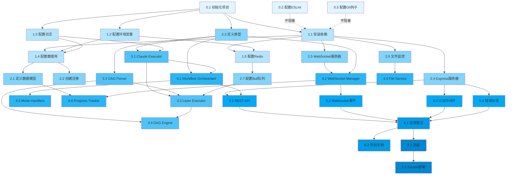

# 后端开发计划 - DAG 路线图

## 文档说明

**重要提示**：本开发计划是为 Claude Code AI 自动执行设计的 DAG（有向无环图）路线图，而非给人类开发者的时间表。

### 核心原则

1. **无时间概念**：不包含"第几天"、"何时完成"等时间安排
2. **依赖驱动**：通过依赖关系确定执行顺序
3. **最大并行度**：同一层级（Layer）内的任务可以完全并行执行
4. **层级隔离**：只有当前层级所有任务完成后，才能进入下一层级

### DAG 执行规则

```
Layer 0 任务全部完成 → 进入 Layer 1
Layer 1 任务全部完成 → 进入 Layer 2
...依此类推
```

---

## DAG 层级结构总览

### 统计信息

- **总层级数**: 8 层
- **总任务数**: 32 个任务
- **最大并行度**: 7 个任务（Layer 2）
- **关键路径长度**: 8 层

### 层级摘要

| Layer | 任务数 | 并行度 | 依赖层级 | 描述 |
|-------|--------|--------|----------|------|
| 0 | 3 | 3 | 无 | 基础设施初始化 |
| 1 | 5 | 5 | Layer 0 | 核心配置 |
| 2 | 7 | 7 | Layer 1 | 数据层与基础服务 |
| 3 | 4 | 4 | Layer 2 | 核心执行引擎 |
| 4 | 5 | 5 | Layer 3 | 业务逻辑层 |
| 5 | 4 | 4 | Layer 4 | API 与通信层 |
| 6 | 2 | 2 | Layer 5 | 应用整合 |
| 7 | 2 | 2 | Layer 6 | 测试与部署 |

---

## Layer 0: 基础设施层

**特点**: 无任何依赖，可完全并行执行

### Task 0.1: 初始化 Node.js + TypeScript 项目

**任务 ID**: `backend-0.1`

**依赖**: 无

**目标**:
- 初始化 Node.js 项目
- 配置 TypeScript
- 配置基础的 tsconfig.json
- 验证项目可以编译运行

**实现步骤**:
1. 初始化项目：
   ```bash
   mkdir backend
   cd backend
   npm init -y
   ```
2. 安装 TypeScript 和 Node.js 类型：
   ```bash
   npm install -D typescript @types/node ts-node nodemon
   ```
3. 创建 `tsconfig.json`：
   ```json
   {
     "compilerOptions": {
       "target": "ES2020",
       "module": "commonjs",
       "lib": ["ES2020"],
       "outDir": "./dist",
       "rootDir": "./src",
       "strict": true,
       "esModuleInterop": true,
       "skipLibCheck": true,
       "forceConsistentCasingInFileNames": true,
       "resolveJsonModule": true,
       "moduleResolution": "node",
       "baseUrl": "./src",
       "paths": {
         "@/*": ["./*"]
       }
     },
     "include": ["src/**/*"],
     "exclude": ["node_modules", "dist"]
   }
   ```
4. 创建基础目录结构：
   ```bash
   mkdir -p src/{config,controllers,services,models,routes,middleware,utils,types}
   ```
5. 创建 `src/index.ts` 入口文件
6. 配置 npm scripts：
   ```json
   {
     "scripts": {
       "dev": "nodemon --exec ts-node src/index.ts",
       "build": "tsc",
       "start": "node dist/index.js"
     }
   }
   ```
7. 创建简单的 Hello World 测试

**期望输出**:
- ✅ `backend/` 目录创建成功
- ✅ `package.json` 配置完成
- ✅ `tsconfig.json` 配置完成
- ✅ TypeScript 可以编译成功
- ✅ `npm run dev` 可以启动

**验证标准**:
```bash
cd backend
npm run build  # 应该成功编译到 dist/
npm run dev    # 应该启动开发服务器
```

---

### Task 0.2: 配置 ESLint + Prettier 代码规范

**任务 ID**: `backend-0.2`

**依赖**: 无

**目标**:
- 配置 ESLint 代码检查
- 配置 Prettier 代码格式化
- 集成 TypeScript ESLint
- 配置自动格式化

**实现步骤**:
1. 安装依赖：
   ```bash
   npm install -D eslint @typescript-eslint/parser @typescript-eslint/eslint-plugin
   npm install -D prettier eslint-config-prettier eslint-plugin-prettier
   ```
2. 创建 `.eslintrc.js`：
   ```javascript
   module.exports = {
     parser: '@typescript-eslint/parser',
     extends: [
       'eslint:recommended',
       'plugin:@typescript-eslint/recommended',
       'prettier'
     ],
     plugins: ['@typescript-eslint', 'prettier'],
     rules: {
       'prettier/prettier': 'error',
       '@typescript-eslint/no-explicit-any': 'warn',
       '@typescript-eslint/explicit-function-return-type': 'off'
     },
     env: {
       node: true,
       es2020: true
     }
   };
   ```
3. 创建 `.prettierrc`：
   ```json
   {
     "semi": true,
     "trailingComma": "es5",
     "singleQuote": true,
     "printWidth": 100,
     "tabWidth": 2
   }
   ```
4. 创建 `.eslintignore` 和 `.prettierignore`
5. 添加 npm scripts：
   ```json
   {
     "scripts": {
       "lint": "eslint src --ext .ts",
       "lint:fix": "eslint src --ext .ts --fix",
       "format": "prettier --write \"src/**/*.ts\""
     }
   }
   ```

**期望输出**:
- ✅ ESLint 配置完成
- ✅ Prettier 配置完成
- ✅ `npm run lint` 可以检查代码
- ✅ `npm run format` 可以格式化代码

**验证标准**:
```bash
npm run lint     # 应该检查所有 .ts 文件
npm run format   # 应该格式化所有文件
```

---

### Task 0.3: 配置 Husky + lint-staged Git 钩子

**任务 ID**: `backend-0.3`

**依赖**: 无

**目标**:
- 配置 Git hooks 管理
- 在 commit 前自动 lint 和 format
- 确保提交的代码符合规范

**实现步骤**:
1. 初始化 Git（如果还没有）：
   ```bash
   git init
   ```
2. 安装依赖：
   ```bash
   npm install -D husky lint-staged
   ```
3. 初始化 Husky：
   ```bash
   npx husky install
   npm pkg set scripts.prepare="husky install"
   ```
4. 创建 pre-commit hook：
   ```bash
   npx husky add .husky/pre-commit "npx lint-staged"
   ```
5. 配置 `package.json` 中的 lint-staged：
   ```json
   {
     "lint-staged": {
       "*.ts": [
         "eslint --fix",
         "prettier --write"
       ]
     }
   }
   ```

**期望输出**:
- ✅ `.husky/` 目录创建
- ✅ pre-commit hook 配置完成
- ✅ Git commit 时会自动运行 lint

**验证标准**:
```bash
# 修改任意 .ts 文件
git add .
git commit -m "test"  # 应该触发 lint-staged
```

---

## Layer 1: 核心配置层

**特点**: 依赖 Layer 0 所有任务完成，本层内可完全并行

**前置条件**: Layer 0 全部任务完成（项目已初始化、代码规范已配置）

### Task 1.1: 安装核心依赖包

**任务 ID**: `backend-1.1`

**依赖**: `backend-0.1`（项目已初始化）

**目标**:
- 安装 Express 和相关中间件
- 安装 WebSocket 库（ws）
- 安装数据库相关依赖
- 安装工具库

**实现步骤**:
1. 安装 Express 及中间件：
   ```bash
   npm install express cors body-parser
   npm install -D @types/express @types/cors @types/body-parser
   ```
2. 安装 WebSocket：
   ```bash
   npm install ws
   npm install -D @types/ws
   ```
3. 安装数据库相关：
   ```bash
   npm install sequelize pg pg-hstore sqlite3
   npm install ioredis
   npm install -D @types/pg
   ```
4. 安装任务队列：
   ```bash
   npm install bull
   npm install -D @types/bull
   ```
5. 安装工具库：
   ```bash
   npm install winston dotenv uuid
   npm install chokidar
   npm install -D @types/uuid
   ```
6. 验证所有依赖安装成功

**期望输出**:
- ✅ 所有核心依赖安装成功
- ✅ `package.json` 包含所有依赖
- ✅ TypeScript 类型定义完整

**验证标准**:
```bash
npm list express sequelize ioredis bull ws winston
# 应该显示所有包的版本
```

---

### Task 1.2: 配置环境变量管理

**任务 ID**: `backend-1.2`

**依赖**: `backend-0.1`（项目已初始化）

**目标**:
- 创建环境变量配置
- 实现类型安全的配置管理
- 支持多环境配置

**实现步骤**:
1. 创建 `.env.example` 模板：
   ```env
   # Server
   NODE_ENV=development
   PORT=3000
   HOST=localhost

   # Database
   DB_TYPE=sqlite
   DB_HOST=localhost
   DB_PORT=5432
   DB_NAME=claude_harness
   DB_USER=postgres
   DB_PASSWORD=password

   # Redis
   REDIS_HOST=localhost
   REDIS_PORT=6379
   REDIS_PASSWORD=

   # Claude API
   ANTHROPIC_API_KEY=sk-ant-xxx
   CLAUDE_MAX_CONCURRENT=10
   CLAUDE_TIMEOUT=600000

   # WebSocket
   WS_PORT=3001

   # Logging
   LOG_LEVEL=info
   LOG_DIR=./logs
   ```
2. 创建 `.env.development` 和 `.env.production`
3. 创建 `src/config/env.ts`：
   ```typescript
   import dotenv from 'dotenv';
   import path from 'path';

   dotenv.config({
     path: path.resolve(process.cwd(), `.env.${process.env.NODE_ENV || 'development'}`)
   });

   export const config = {
     env: process.env.NODE_ENV || 'development',
     port: parseInt(process.env.PORT || '3000', 10),
     host: process.env.HOST || 'localhost',
     database: {
       type: process.env.DB_TYPE as 'sqlite' | 'postgres',
       host: process.env.DB_HOST,
       port: parseInt(process.env.DB_PORT || '5432', 10),
       name: process.env.DB_NAME || 'claude_harness',
       user: process.env.DB_USER,
       password: process.env.DB_PASSWORD,
     },
     redis: {
       host: process.env.REDIS_HOST || 'localhost',
       port: parseInt(process.env.REDIS_PORT || '6379', 10),
       password: process.env.REDIS_PASSWORD,
     },
     claude: {
       apiKey: process.env.ANTHROPIC_API_KEY || '',
       maxConcurrent: parseInt(process.env.CLAUDE_MAX_CONCURRENT || '10', 10),
       timeout: parseInt(process.env.CLAUDE_TIMEOUT || '600000', 10),
     },
     websocket: {
       port: parseInt(process.env.WS_PORT || '3001', 10),
     },
     logging: {
       level: process.env.LOG_LEVEL || 'info',
       dir: process.env.LOG_DIR || './logs',
     },
   };
   ```
4. 添加 `.env` 到 `.gitignore`

**期望输出**:
- ✅ 环境变量模板创建
- ✅ 配置管理模块完成
- ✅ 类型安全的配置访问

**验证标准**:
```typescript
import { config } from '@/config/env';
console.log(config.port); // 应该有类型提示
```

---

### Task 1.3: 配置 Winston 日志系统

**任务 ID**: `backend-1.3`

**依赖**: `backend-0.1`（项目已初始化）、`backend-1.1`（Winston 已安装）

**目标**:
- 配置 Winston 日志记录器
- 实现多级别日志
- 配置日志文件和控制台输出
- 实现日志轮转

**实现步骤**:
1. 创建 `src/utils/logger.ts`：
   ```typescript
   import winston from 'winston';
   import path from 'path';
   import { config } from '@/config/env';

   const logDir = config.logging.dir;

   const logger = winston.createLogger({
     level: config.logging.level,
     format: winston.format.combine(
       winston.format.timestamp({ format: 'YYYY-MM-DD HH:mm:ss' }),
       winston.format.errors({ stack: true }),
       winston.format.splat(),
       winston.format.json()
     ),
     defaultMeta: { service: 'claude-harness-backend' },
     transports: [
       // Error logs
       new winston.transports.File({
         filename: path.join(logDir, 'error.log'),
         level: 'error',
         maxsize: 5242880, // 5MB
         maxFiles: 5,
       }),
       // Combined logs
       new winston.transports.File({
         filename: path.join(logDir, 'combined.log'),
         maxsize: 5242880,
         maxFiles: 5,
       }),
     ],
   });

   // Console output in development
   if (config.env !== 'production') {
     logger.add(
       new winston.transports.Console({
         format: winston.format.combine(
           winston.format.colorize(),
           winston.format.printf(
             ({ level, message, timestamp, ...meta }) =>
               `${timestamp} [${level}]: ${message} ${
                 Object.keys(meta).length ? JSON.stringify(meta, null, 2) : ''
               }`
           )
         ),
       })
     );
   }

   export default logger;
   ```
2. 创建日志目录：
   ```bash
   mkdir -p logs
   ```
3. 添加日志辅助函数

**期望输出**:
- ✅ Winston 配置完成
- ✅ 日志可以写入文件和控制台
- ✅ 不同级别日志分离

**验证标准**:
```typescript
import logger from '@/utils/logger';
logger.info('Test info log');
logger.error('Test error log');
// 应该在控制台和文件中看到日志
```

---

### Task 1.4: 配置 PostgreSQL 数据库连接（Sequelize）

**任务 ID**: `backend-1.4`

**依赖**: `backend-0.1`（项目已初始化）、`backend-1.1`（Sequelize 已安装）、`backend-1.2`（环境变量已配置）

**目标**:
- 配置 Sequelize ORM
- 支持 SQLite（开发）和 PostgreSQL（生产）
- 配置连接池
- 测试数据库连接

**实现步骤**:
1. 创建 `src/config/database.ts`：
   ```typescript
   import { Sequelize } from 'sequelize';
   import { config } from './env';
   import logger from '@/utils/logger';

   let sequelize: Sequelize;

   if (config.database.type === 'sqlite') {
     sequelize = new Sequelize({
       dialect: 'sqlite',
       storage: './database.sqlite',
       logging: (msg) => logger.debug(msg),
     });
   } else {
     sequelize = new Sequelize({
       dialect: 'postgres',
       host: config.database.host,
       port: config.database.port,
       database: config.database.name,
       username: config.database.user,
       password: config.database.password,
       logging: (msg) => logger.debug(msg),
       pool: {
         max: 20,
         min: 5,
         acquire: 30000,
         idle: 10000,
       },
     });
   }

   export const connectDatabase = async () => {
     try {
       await sequelize.authenticate();
       logger.info('Database connection established successfully');
       return sequelize;
     } catch (error) {
       logger.error('Unable to connect to database:', error);
       throw error;
     }
   };

   export { sequelize };
   ```
2. 创建数据库初始化函数
3. 测试连接

**期望输出**:
- ✅ Sequelize 配置完成
- ✅ 支持 SQLite 和 PostgreSQL 切换
- ✅ 数据库连接成功

**验证标准**:
```typescript
import { connectDatabase } from '@/config/database';
await connectDatabase(); // 应该成功连接
```

---

### Task 1.5: 配置 Redis 连接

**任务 ID**: `backend-1.5`

**依赖**: `backend-0.1`（项目已初始化）、`backend-1.1`（ioredis 已安装）、`backend-1.2`（环境变量已配置）

**目标**:
- 配置 Redis 客户端
- 实现连接管理
- 实现错误处理和重连
- 创建 Redis 工具函数

**实现步骤**:
1. 创建 `src/config/redis.ts`：
   ```typescript
   import Redis from 'ioredis';
   import { config } from './env';
   import logger from '@/utils/logger';

   const redisClient = new Redis({
     host: config.redis.host,
     port: config.redis.port,
     password: config.redis.password,
     retryStrategy(times) {
       const delay = Math.min(times * 50, 2000);
       return delay;
     },
     maxRetriesPerRequest: 3,
   });

   redisClient.on('connect', () => {
     logger.info('Redis connected successfully');
   });

   redisClient.on('error', (err) => {
     logger.error('Redis connection error:', err);
   });

   redisClient.on('ready', () => {
     logger.info('Redis is ready');
   });

   export const connectRedis = async () => {
     try {
       await redisClient.ping();
       logger.info('Redis ping successful');
       return redisClient;
     } catch (error) {
       logger.error('Redis connection failed:', error);
       throw error;
     }
   };

   export { redisClient };
   ```
2. 创建 `src/services/cache.service.ts`（缓存服务）：
   ```typescript
   import { redisClient } from '@/config/redis';

   export class CacheService {
     async get<T>(key: string): Promise<T | null> {
       const value = await redisClient.get(key);
       return value ? JSON.parse(value) : null;
     }

     async set(key: string, value: any, ttl?: number): Promise<void> {
       const serialized = JSON.stringify(value);
       if (ttl) {
         await redisClient.setex(key, ttl, serialized);
       } else {
         await redisClient.set(key, serialized);
       }
     }

     async del(key: string): Promise<void> {
       await redisClient.del(key);
     }

     async exists(key: string): Promise<boolean> {
       const result = await redisClient.exists(key);
       return result === 1;
     }
   }

   export const cacheService = new CacheService();
   ```

**期望输出**:
- ✅ Redis 客户端配置完成
- ✅ 连接和重连机制实现
- ✅ 缓存服务可用

**验证标准**:
```typescript
import { connectRedis } from '@/config/redis';
import { cacheService } from '@/services/cache.service';
await connectRedis();
await cacheService.set('test', { value: 'hello' });
const result = await cacheService.get('test');
// result 应该是 { value: 'hello' }
```

---

## Layer 2: 数据层与基础服务层

**特点**: 依赖 Layer 1 所有任务完成，本层内可完全并行

**前置条件**: Layer 1 全部任务完成（核心配置、数据库连接都已完成）

### Task 2.1: 定义 Sequelize 数据模型

**任务 ID**: `backend-2.1`

**依赖**: `backend-1.4`（数据库连接已配置）

**目标**:
- 定义所有数据库模型
- 实现模型关联
- 配置索引
- 创建模型导出

**实现步骤**:
1. 创建 `src/models/Project.ts`：
   ```typescript
   import { Model, DataTypes, Optional } from 'sequelize';
   import { sequelize } from '@/config/database';

   interface ProjectAttributes {
     id: string;
     name: string;
     type: 'fullstack' | 'frontend' | 'backend';
     status: string;
     current_mode: string | null;
     root_path: string;
     created_at: Date;
     updated_at: Date;
   }

   interface ProjectCreationAttributes extends Optional<ProjectAttributes, 'id' | 'current_mode' | 'created_at' | 'updated_at'> {}

   export class Project extends Model<ProjectAttributes, ProjectCreationAttributes> implements ProjectAttributes {
     public id!: string;
     public name!: string;
     public type!: 'fullstack' | 'frontend' | 'backend';
     public status!: string;
     public current_mode!: string | null;
     public root_path!: string;
     public readonly created_at!: Date;
     public readonly updated_at!: Date;
   }

   Project.init(
     {
       id: {
         type: DataTypes.UUID,
         defaultValue: DataTypes.UUIDV4,
         primaryKey: true,
       },
       name: {
         type: DataTypes.STRING(255),
         allowNull: false,
       },
       type: {
         type: DataTypes.STRING(50),
         allowNull: false,
       },
       status: {
         type: DataTypes.STRING(50),
         allowNull: false,
       },
       current_mode: {
         type: DataTypes.STRING(50),
         allowNull: true,
       },
       root_path: {
         type: DataTypes.STRING(500),
         allowNull: false,
       },
       created_at: {
         type: DataTypes.DATE,
         defaultValue: DataTypes.NOW,
       },
       updated_at: {
         type: DataTypes.DATE,
         defaultValue: DataTypes.NOW,
       },
     },
     {
       sequelize,
       tableName: 'projects',
       underscored: true,
       timestamps: true,
     }
   );
   ```
2. 创建其他模型：
   - `src/models/TaskExecution.ts`
   - `src/models/LayerExecution.ts`
   - `src/models/ExecutionLog.ts`
   - `src/models/TestRun.ts`
   - `src/models/Deployment.ts`
3. 创建 `src/models/index.ts` 导出所有模型
4. 配置模型关联（外键关系）

**期望输出**:
- ✅ 所有模型定义完成
- ✅ 模型关联配置完成
- ✅ TypeScript 类型完整

**验证标准**:
```typescript
import { Project } from '@/models/Project';
const project = await Project.create({
  name: 'Test',
  type: 'fullstack',
  status: 'initializing',
  root_path: '/path/to/project'
});
// 应该成功创建
```

---

### Task 2.2: 创建数据库迁移脚本

**任务 ID**: `backend-2.2`

**依赖**: `backend-2.1`（模型已定义）

**目标**:
- 创建数据库表结构
- 实现同步脚本
- 支持数据迁移
- 创建初始数据

**实现步骤**:
1. 创建 `src/scripts/sync-database.ts`：
   ```typescript
   import { sequelize } from '@/config/database';
   import '@/models'; // 导入所有模型
   import logger from '@/utils/logger';

   async function syncDatabase() {
     try {
       await sequelize.sync({ force: false });
       logger.info('Database synchronized successfully');
     } catch (error) {
       logger.error('Database sync failed:', error);
       throw error;
     }
   }

   syncDatabase();
   ```
2. 添加 npm script：
   ```json
   {
     "scripts": {
       "db:sync": "ts-node src/scripts/sync-database.ts",
       "db:reset": "ts-node src/scripts/reset-database.ts"
     }
   }
   ```
3. 创建索引创建脚本
4. 测试数据库同步

**期望输出**:
- ✅ 数据库同步脚本创建
- ✅ 所有表创建成功
- ✅ 索引创建成功

**验证标准**:
```bash
npm run db:sync
# 应该创建所有表
```

---

### Task 2.3: 定义全局 TypeScript 类型

**任务 ID**: `backend-2.3`

**依赖**: `backend-0.1`（项目已初始化）

**目标**:
- 定义业务类型
- 定义 API 类型
- 定义 WebSocket 消息类型
- 定义工作模式类型

**实现步骤**:
1. 创建 `src/types/task.types.ts`：
   ```typescript
   export interface Task {
     id: string;
     layer: number;
     sequence: number;
     name: string;
     description: string;
     dependencies: string[];
     status: 'pending' | 'running' | 'completed' | 'failed';
     started_at?: Date;
     completed_at?: Date;
     error?: string;
     output?: string;
   }

   export interface Layer {
     layer_num: number;
     depends_on: number[];
     tasks: Task[];
     parallel: boolean;
     status: 'pending' | 'running' | 'completed' | 'failed';
   }

   export interface TaskIndex {
     project_type: 'frontend' | 'backend' | 'fullstack';
     total_tasks: number;
     total_layers: number;
     max_parallel: number;
     layers: Record<string, Layer>;
     dag_mermaid: string;
   }
   ```
2. 创建 `src/types/mode.types.ts`：
   ```typescript
   export enum WorkMode {
     PRD = 'prd',
     ARCHITECTURE = 'architecture',
     DEV_PLAN = 'dev_plan',
     TASK_GEN = 'task_gen',
     TASK_EXEC = 'task_exec',
     LOOP_TEST = 'loop_test',
     DEPLOY = 'deploy',
   }

   export interface ModeExecutionResult {
     success: boolean;
     output: string;
     artifacts: string[];
     nextMode?: WorkMode;
     error?: string;
   }
   ```
3. 创建 `src/types/websocket.types.ts`：
   ```typescript
   export interface WebSocketMessage {
     type: 'command' | 'status' | 'output' | 'progress' | 'error';
     payload: any;
     timestamp: number;
     correlationId?: string;
   }

   export interface TaskStatusUpdate {
     taskId: string;
     status: 'pending' | 'running' | 'completed' | 'failed';
     progress?: number;
     error?: string;
   }
   ```
4. 创建 `src/types/index.ts` 导出所有类型

**期望输出**:
- ✅ 所有类型定义完成
- ✅ 类型导出正确
- ✅ TypeScript 编译无错误

**验证标准**:
```typescript
import { Task, WorkMode, WebSocketMessage } from '@/types';
// TypeScript 能正确识别类型
```

---

### Task 2.4: 实现 Express 服务器基础架构

**任务 ID**: `backend-2.4`

**依赖**: `backend-1.1`（Express 已安装）、`backend-1.2`（环境变量已配置）

**目标**:
- 创建 Express 应用
- 配置中间件
- 实现基础路由
- 实现错误处理

**实现步骤**:
1. 创建 `src/app.ts`：
   ```typescript
   import express, { Application, Request, Response, NextFunction } from 'express';
   import cors from 'cors';
   import bodyParser from 'body-parser';
   import { config } from './config/env';
   import logger from './utils/logger';

   export const createApp = (): Application => {
     const app = express();

     // Middleware
     app.use(cors({
       origin: config.env === 'production' ? 'https://yourdomain.com' : '*',
       credentials: true,
     }));
     app.use(bodyParser.json());
     app.use(bodyParser.urlencoded({ extended: true }));

     // Request logging
     app.use((req: Request, res: Response, next: NextFunction) => {
       logger.info(`${req.method} ${req.path}`);
       next();
     });

     // Health check
     app.get('/health', (req: Request, res: Response) => {
       res.json({ status: 'ok', timestamp: new Date().toISOString() });
     });

     // API routes (will be added later)
     app.use('/api', (req: Request, res: Response) => {
       res.json({ message: 'API routes will be added here' });
     });

     // 404 handler
     app.use((req: Request, res: Response) => {
       res.status(404).json({ error: 'Not found' });
     });

     // Error handler
     app.use((err: Error, req: Request, res: Response, next: NextFunction) => {
       logger.error('Error:', err);
       res.status(500).json({
         error: config.env === 'production' ? 'Internal server error' : err.message,
       });
     });

     return app;
   };
   ```
2. 更新 `src/index.ts`：
   ```typescript
   import { createApp } from './app';
   import { config } from './config/env';
   import { connectDatabase } from './config/database';
   import { connectRedis } from './config/redis';
   import logger from './utils/logger';

   async function bootstrap() {
     try {
       // Connect to database
       await connectDatabase();

       // Connect to Redis
       await connectRedis();

       // Create Express app
       const app = createApp();

       // Start server
       app.listen(config.port, config.host, () => {
         logger.info(`Server running on http://${config.host}:${config.port}`);
       });
     } catch (error) {
       logger.error('Failed to start server:', error);
       process.exit(1);
     }
   }

   bootstrap();
   ```

**期望输出**:
- ✅ Express 应用创建成功
- ✅ 中间件配置完成
- ✅ 错误处理实现
- ✅ 服务器可以启动

**验证标准**:
```bash
npm run dev
curl http://localhost:3000/health
# 应该返回 {"status":"ok"}
```

---

### Task 2.5: 实现 WebSocket 服务器基础

**任务 ID**: `backend-2.5`

**依赖**: `backend-1.1`（ws 已安装）、`backend-2.4`（Express 服务器已创建）

**目标**:
- 创建 WebSocket 服务器
- 实现连接管理
- 实现消息路由
- 实现心跳检测

**实现步骤**:
1. 创建 `src/services/websocket/WebSocketServer.ts`：
   ```typescript
   import WebSocket, { WebSocketServer as WSServer } from 'ws';
   import { Server } from 'http';
   import logger from '@/utils/logger';
   import { WebSocketMessage } from '@/types';

   export class WebSocketServer {
     private wss: WSServer;
     private clients: Map<string, WebSocket> = new Map();

     constructor(server: Server) {
       this.wss = new WSServer({ server, path: '/ws' });
       this.initialize();
     }

     private initialize() {
       this.wss.on('connection', (ws: WebSocket, req) => {
         const clientId = this.generateClientId();
         this.clients.set(clientId, ws);
         logger.info(`WebSocket client connected: ${clientId}`);

         // Send welcome message
         this.sendToClient(clientId, {
           type: 'status',
           payload: { message: 'Connected successfully' },
           timestamp: Date.now(),
         });

         // Handle messages
         ws.on('message', (data: WebSocket.Data) => {
           this.handleMessage(clientId, data);
         });

         // Handle disconnect
         ws.on('close', () => {
           this.clients.delete(clientId);
           logger.info(`WebSocket client disconnected: ${clientId}`);
         });

         // Handle errors
         ws.on('error', (error) => {
           logger.error(`WebSocket error for client ${clientId}:`, error);
         });

         // Heartbeat
         this.setupHeartbeat(clientId, ws);
       });
     }

     private handleMessage(clientId: string, data: WebSocket.Data) {
       try {
         const message: WebSocketMessage = JSON.parse(data.toString());
         logger.debug(`Received message from ${clientId}:`, message);
         // Message handling will be implemented later
       } catch (error) {
         logger.error('Failed to parse WebSocket message:', error);
       }
     }

     private setupHeartbeat(clientId: string, ws: WebSocket) {
       const interval = setInterval(() => {
         if (ws.readyState === WebSocket.OPEN) {
           ws.ping();
         } else {
           clearInterval(interval);
         }
       }, 30000); // 30 seconds

       ws.on('pong', () => {
         logger.debug(`Heartbeat from ${clientId}`);
       });
     }

     public sendToClient(clientId: string, message: WebSocketMessage) {
       const client = this.clients.get(clientId);
       if (client && client.readyState === WebSocket.OPEN) {
         client.send(JSON.stringify(message));
       }
     }

     public broadcast(message: WebSocketMessage) {
       this.clients.forEach((client, clientId) => {
         this.sendToClient(clientId, message);
       });
     }

     private generateClientId(): string {
       return `client-${Date.now()}-${Math.random().toString(36).substr(2, 9)}`;
     }
   }
   ```
2. 集成到 `src/index.ts`：
   ```typescript
   import http from 'http';
   import { WebSocketServer } from './services/websocket/WebSocketServer';

   const server = http.createServer(app);
   const wsServer = new WebSocketServer(server);

   server.listen(config.port, config.host, () => {
     logger.info(`Server running on http://${config.host}:${config.port}`);
     logger.info(`WebSocket server running on ws://${config.host}:${config.port}/ws`);
   });
   ```

**期望输出**:
- ✅ WebSocket 服务器创建成功
- ✅ 连接管理实现
- ✅ 心跳检测工作正常

**验证标准**:
```bash
# 使用 wscat 测试
npx wscat -c ws://localhost:3000/ws
# 应该能连接并收到欢迎消息
```

---

### Task 2.6: 实现文件系统监控服务

**任务 ID**: `backend-2.6`

**依赖**: `backend-1.1`（chokidar 已安装）

**目标**:
- 实现文件系统监控
- 检测文件变更
- 通过 WebSocket 通知
- 实现过滤规则

**实现步骤**:
1. 创建 `src/services/FileSystemMonitor.ts`：
   ```typescript
   import chokidar, { FSWatcher } from 'chokidar';
   import logger from '@/utils/logger';

   export class FileSystemMonitor {
     private watcher: FSWatcher | null = null;
     private onFileChange?: (type: string, path: string) => void;

     start(watchPaths: string[], onChange: (type: string, path: string) => void) {
       this.onFileChange = onChange;

       this.watcher = chokidar.watch(watchPaths, {
         ignored: /(^|[\/\\])\../, // ignore dotfiles
         persistent: true,
         ignoreInitial: true,
         awaitWriteFinish: {
           stabilityThreshold: 500,
           pollInterval: 100,
         },
       });

       this.watcher
         .on('add', (path) => this.handleFileChange('create', path))
         .on('change', (path) => this.handleFileChange('update', path))
         .on('unlink', (path) => this.handleFileChange('delete', path))
         .on('addDir', (path) => this.handleFileChange('create', path))
         .on('unlinkDir', (path) => this.handleFileChange('delete', path))
         .on('error', (error) => logger.error('File watcher error:', error));

       logger.info(`File system monitor started for paths: ${watchPaths.join(', ')}`);
     }

     private handleFileChange(type: string, path: string) {
       logger.debug(`File ${type}: ${path}`);
       if (this.onFileChange) {
         this.onFileChange(type, path);
       }
     }

     stop() {
       if (this.watcher) {
         this.watcher.close();
         logger.info('File system monitor stopped');
       }
     }
   }

   export const fileSystemMonitor = new FileSystemMonitor();
   ```
2. 创建文件监控配置

**期望输出**:
- ✅ 文件监控服务创建成功
- ✅ 可以检测文件变更
- ✅ 回调函数正常触发

**验证标准**:
```typescript
fileSystemMonitor.start(['./context'], (type, path) => {
  console.log(`File ${type}: ${path}`);
});
// 修改 context 目录下的文件，应该触发回调
```

---

### Task 2.7: 配置 Bull 任务队列

**任务 ID**: `backend-2.7`

**依赖**: `backend-1.1`（Bull 已安装）、`backend-1.5`（Redis 已配置）

**目标**:
- 配置 Bull 任务队列
- 创建任务队列管理器
- 实现任务处理器
- 配置并发控制

**实现步骤**:
1. 创建 `src/services/queue/TaskQueue.ts`：
   ```typescript
   import Bull, { Queue, Job } from 'bull';
   import { config } from '@/config/env';
   import logger from '@/utils/logger';

   export interface ClaudeTaskData {
     taskId: string;
     prompt: string;
     options?: {
       timeout?: number;
       maxRetries?: number;
     };
   }

   export class TaskQueue {
     private queue: Queue<ClaudeTaskData>;

     constructor() {
       this.queue = new Bull<ClaudeTaskData>('claude-tasks', {
         redis: {
           host: config.redis.host,
           port: config.redis.port,
           password: config.redis.password,
         },
         limiter: {
           max: config.claude.maxConcurrent,
           duration: 60000, // 1 minute
         },
       });

       this.setupEventHandlers();
     }

     private setupEventHandlers() {
       this.queue.on('completed', (job: Job<ClaudeTaskData>) => {
         logger.info(`Task completed: ${job.data.taskId}`);
       });

       this.queue.on('failed', (job: Job<ClaudeTaskData>, err: Error) => {
         logger.error(`Task failed: ${job.data.taskId}`, err);
       });

       this.queue.on('stalled', (job: Job<ClaudeTaskData>) => {
         logger.warn(`Task stalled: ${job.data.taskId}`);
       });
     }

     async addTask(data: ClaudeTaskData): Promise<Job<ClaudeTaskData>> {
       return this.queue.add(data, {
         attempts: data.options?.maxRetries || 3,
         backoff: {
           type: 'exponential',
           delay: 2000,
         },
         timeout: data.options?.timeout || config.claude.timeout,
       });
     }

     async processTask(processor: (job: Job<ClaudeTaskData>) => Promise<any>) {
       this.queue.process(config.claude.maxConcurrent, processor);
     }

     async getJobStatus(jobId: string) {
       const job = await this.queue.getJob(jobId);
       return job ? await job.getState() : null;
     }

     async shutdown() {
       await this.queue.close();
     }
   }

   export const taskQueue = new TaskQueue();
   ```
2. 创建队列监控工具

**期望输出**:
- ✅ Bull 队列配置完成
- ✅ 任务可以添加到队列
- ✅ 并发控制生效

**验证标准**:
```typescript
import { taskQueue } from '@/services/queue/TaskQueue';
await taskQueue.addTask({
  taskId: 'test-1',
  prompt: 'Test prompt'
});
// 任务应该添加到 Redis 队列
```

---

## Layer 3: 核心执行引擎层

**特点**: 依赖 Layer 2 所有任务完成，本层内可完全并行

**前置条件**: Layer 2 全部任务完成（数据层、基础服务都已完成）

### Task 3.1: 实现 Claude Code Executor（进程执行器）

**任务 ID**: `backend-3.1`

**依赖**: `backend-2.3`（类型已定义）、`backend-1.3`（日志已配置）

**目标**:
- 实现 `claude -p` 进程管理
- 实现输出流捕获
- 实现超时和重试
- 实现并发控制

**实现步骤**:
1. 创建 `src/services/ClaudeCodeExecutor.ts`：
   ```typescript
   import { spawn, ChildProcess } from 'child_process';
   import logger from '@/utils/logger';
   import { config } from '@/config/env';

   export interface ExecutionOptions {
     taskId?: string;
     timeout?: number;
     maxRetries?: number;
     workingDir?: string;
     env?: Record<string, string>;
     onProgress?: (output: string) => void;
     onError?: (error: Error) => void;
   }

   export interface ExecutionResult {
     success: boolean;
     output: string;
     error?: string;
     exitCode: number;
     duration: number;
     retries: number;
   }

   export class ClaudeCodeExecutor {
     private processPool: Map<string, ChildProcess> = new Map();

     async execute(prompt: string, options: ExecutionOptions = {}): Promise<ExecutionResult> {
       const startTime = Date.now();
       let retries = 0;
       const maxRetries = options.maxRetries || 3;

       while (retries <= maxRetries) {
         try {
           const result = await this.executeOnce(prompt, options);
           return {
             success: true,
             output: result.output,
             exitCode: 0,
             duration: Date.now() - startTime,
             retries,
           };
         } catch (error: any) {
           retries++;
           logger.warn(`Execution attempt ${retries} failed:`, error.message);

           if (retries > maxRetries) {
             return {
               success: false,
               output: '',
               error: error.message,
               exitCode: error.exitCode || 1,
               duration: Date.now() - startTime,
               retries,
             };
           }

           // Exponential backoff
           await this.sleep(Math.pow(2, retries) * 1000);
         }
       }

       throw new Error('Unreachable code');
     }

     private executeOnce(prompt: string, options: ExecutionOptions): Promise<{ output: string }> {
       return new Promise((resolve, reject) => {
         const process = spawn('claude', ['-p', prompt], {
           cwd: options.workingDir || process.cwd(),
           env: { ...process.env, ...options.env },
           shell: true,
         });

         const processId = `${options.taskId || 'unnamed'}-${Date.now()}`;
         this.processPool.set(processId, process);

         let output = '';
         let errorOutput = '';

         // Capture stdout
         process.stdout.on('data', (chunk: Buffer) => {
           const text = chunk.toString();
           output += text;

           if (options.onProgress) {
             options.onProgress(text);
           }
         });

         // Capture stderr
         process.stderr.on('data', (chunk: Buffer) => {
           errorOutput += chunk.toString();
         });

         // Timeout handling
         const timeout = options.timeout || config.claude.timeout;
         const timer = setTimeout(() => {
           process.kill('SIGTERM');
           reject(new Error(`Execution timeout after ${timeout}ms`));
         }, timeout);

         // Process exit
         process.on('exit', (code) => {
           clearTimeout(timer);
           this.processPool.delete(processId);

           if (code === 0) {
             resolve({ output });
           } else {
             reject({
               message: `Claude process exited with code ${code}`,
               exitCode: code,
               stderr: errorOutput,
             });
           }
         });

         // Error handling
         process.on('error', (error) => {
           clearTimeout(timer);
           this.processPool.delete(processId);
           reject(error);
         });
       });
     }

     private sleep(ms: number): Promise<void> {
       return new Promise((resolve) => setTimeout(resolve, ms));
     }

     async shutdown(): Promise<void> {
       const killPromises = Array.from(this.processPool.values()).map((proc) => {
         return new Promise<void>((resolve) => {
           proc.once('exit', () => resolve());
           proc.kill('SIGTERM');

           setTimeout(() => {
             proc.kill('SIGKILL');
             resolve();
           }, 5000);
         });
       });

       await Promise.all(killPromises);
     }
   }

   export const claudeCodeExecutor = new ClaudeCodeExecutor();
   ```
2. 添加进程池管理
3. 实现优雅关闭

**期望输出**:
- ✅ Claude CLI 进程可以执行
- ✅ 输出流可以捕获
- ✅ 超时和重试机制工作
- ✅ 并发控制生效

**验证标准**:
```typescript
const result = await claudeCodeExecutor.execute('Test prompt', {
  taskId: 'test-1',
  onProgress: (output) => console.log(output)
});
// 应该执行 claude -p 并返回结果
```

---

### Task 3.2: 实现 DAG Parser（任务索引解析器）

**任务 ID**: `backend-3.2`

**依赖**: `backend-2.3`（类型已定义）

**目标**:
- 解析 tasks-index.json
- 验证 DAG 结构
- 检测循环依赖
- 构建依赖图

**实现步骤**:
1. 创建 `src/services/dag/DAGParser.ts`：
   ```typescript
   import fs from 'fs/promises';
   import path from 'path';
   import logger from '@/utils/logger';
   import { TaskIndex, Layer, Task } from '@/types';

   export class DAGParser {
     async parseTaskIndex(filePath: string): Promise<TaskIndex> {
       try {
         const content = await fs.readFile(filePath, 'utf-8');
         const taskIndex: TaskIndex = JSON.parse(content);

         // Validate structure
         this.validateTaskIndex(taskIndex);

         logger.info(`Parsed task index: ${taskIndex.total_tasks} tasks in ${taskIndex.total_layers} layers`);
         return taskIndex;
       } catch (error) {
         logger.error('Failed to parse task index:', error);
         throw error;
       }
     }

     private validateTaskIndex(taskIndex: TaskIndex) {
       if (!taskIndex.layers || Object.keys(taskIndex.layers).length === 0) {
         throw new Error('Task index has no layers');
       }

       // Check for cycles
       if (this.hasCycle(taskIndex)) {
         throw new Error('Task index contains circular dependencies');
       }

       // Validate dependencies
       this.validateDependencies(taskIndex);
     }

     private hasCycle(taskIndex: TaskIndex): boolean {
       const visited = new Set<string>();
       const recStack = new Set<string>();

       const allTasks = Object.values(taskIndex.layers).flatMap((layer) => layer.tasks);

       for (const task of allTasks) {
         if (this.detectCycleDFS(task, allTasks, visited, recStack)) {
           return true;
         }
       }

       return false;
     }

     private detectCycleDFS(
       task: Task,
       allTasks: Task[],
       visited: Set<string>,
       recStack: Set<string>
     ): boolean {
       if (recStack.has(task.id)) {
         return true;
       }

       if (visited.has(task.id)) {
         return false;
       }

       visited.add(task.id);
       recStack.add(task.id);

       for (const depId of task.dependencies) {
         const depTask = allTasks.find((t) => t.id === depId);
         if (depTask && this.detectCycleDFS(depTask, allTasks, visited, recStack)) {
           return true;
         }
       }

       recStack.delete(task.id);
       return false;
     }

     private validateDependencies(taskIndex: TaskIndex) {
       const allTaskIds = new Set(
         Object.values(taskIndex.layers).flatMap((layer) => layer.tasks.map((t) => t.id))
       );

       for (const layer of Object.values(taskIndex.layers)) {
         for (const task of layer.tasks) {
           for (const depId of task.dependencies) {
             if (!allTaskIds.has(depId)) {
               throw new Error(`Task ${task.id} has invalid dependency: ${depId}`);
             }
           }
         }
       }
     }

     getLayersInOrder(taskIndex: TaskIndex): Layer[] {
       return Object.values(taskIndex.layers).sort((a, b) => a.layer_num - b.layer_num);
     }

     getTaskDependencies(task: Task, allTasks: Task[]): Task[] {
       return task.dependencies
         .map((depId) => allTasks.find((t) => t.id === depId))
         .filter((t): t is Task => t !== undefined);
     }
   }

   export const dagParser = new DAGParser();
   ```
2. 添加拓扑排序算法
3. 添加依赖解析工具

**期望输出**:
- ✅ 可以解析 tasks-index.json
- ✅ DAG 验证正确
- ✅ 循环依赖检测工作
- ✅ 依赖关系正确解析

**验证标准**:
```typescript
const taskIndex = await dagParser.parseTaskIndex('./context/dev-tasks/frontend/tasks-index.json');
const layers = dagParser.getLayersInOrder(taskIndex);
// 应该返回按顺序排列的层级
```

---

### Task 3.3: 实现 Layer Executor（层级执行器）

**任务 ID**: `backend-3.3`

**依赖**: `backend-3.1`（Claude Executor 已实现）、`backend-3.2`（DAG Parser 已实现）、`backend-2.7`（任务队列已配置）

**目标**:
- 实现层级执行逻辑
- 实现层内并行执行
- 实现层间顺序执行
- 实现失败处理

**实现步骤**:
1. 创建 `src/services/dag/LayerExecutor.ts`：
   ```typescript
   import { Layer, Task } from '@/types';
   import { claudeCodeExecutor } from '@/services/ClaudeCodeExecutor';
   import logger from '@/utils/logger';
   import fs from 'fs/promises';

   export interface TaskResult {
     taskId: string;
     status: 'completed' | 'failed';
     output: string;
     error?: string;
     duration: number;
   }

   export interface LayerResult {
     layer_num: number;
     status: 'completed' | 'failed';
     totalTasks: number;
     completedTasks: number;
     failedTasks: number;
     failures: TaskResult[];
     duration: number;
   }

   export class LayerExecutor {
     async executeLayer(layer: Layer): Promise<LayerResult> {
       const startTime = Date.now();
       logger.info(`Executing Layer ${layer.layer_num} (${layer.tasks.length} tasks)`);

       // Execute all tasks in parallel
       const taskPromises = layer.tasks.map((task) =>
         this.executeTask(task).catch((error) => ({
           taskId: task.id,
           status: 'failed' as const,
           output: '',
           error: error.message,
           duration: 0,
         }))
       );

       const taskResults = await Promise.all(taskPromises);

       // Analyze results
       const failures = taskResults.filter((r) => r.status === 'failed');
       const completed = taskResults.filter((r) => r.status === 'completed');

       const result: LayerResult = {
         layer_num: layer.layer_num,
         status: failures.length === 0 ? 'completed' : 'failed',
         totalTasks: layer.tasks.length,
         completedTasks: completed.length,
         failedTasks: failures.length,
         failures,
         duration: Date.now() - startTime,
       };

       if (failures.length === 0) {
         logger.info(`Layer ${layer.layer_num} completed successfully ✅`);
       } else {
         logger.error(`Layer ${layer.layer_num} failed: ${failures.length} tasks failed ❌`);
       }

       return result;
     }

     private async executeTask(task: Task): Promise<TaskResult> {
       const startTime = Date.now();
       logger.info(`Executing task ${task.id}: ${task.name}`);

       try {
         // Read task file
         const taskContent = await this.readTaskFile(task.file);

         // Extract Claude prompt
         const prompt = this.extractClaudePrompt(taskContent);

         // Execute Claude
         const result = await claudeCodeExecutor.execute(prompt, {
           taskId: task.id,
           timeout: 600000, // 10 minutes
           onProgress: (output) => {
             logger.debug(`Task ${task.id} output:`, output);
           },
         });

         if (result.success) {
           return {
             taskId: task.id,
             status: 'completed',
             output: result.output,
             duration: Date.now() - startTime,
           };
         } else {
           throw new Error(result.error || 'Unknown error');
         }
       } catch (error: any) {
         logger.error(`Task ${task.id} failed:`, error);
         return {
           taskId: task.id,
           status: 'failed',
           output: '',
           error: error.message,
           duration: Date.now() - startTime,
         };
       }
     }

     private async readTaskFile(fileName: string): Promise<string> {
       // Assuming task files are in context/dev-tasks/
       const filePath = `./context/dev-tasks/${fileName}`;
       return fs.readFile(filePath, 'utf-8');
     }

     private extractClaudePrompt(taskContent: string): string {
       // Extract the prompt section from task markdown
       // Look for "## Claude执行Prompt" or similar section
       const match = taskContent.match(/## Claude[执行]*Prompt\s*\n([\s\S]+?)(?=\n##|$)/i);
       if (match) {
         return match[1].trim();
       }
       // If no specific prompt section, use the entire content
       return taskContent;
     }
   }

   export const layerExecutor = new LayerExecutor();
   ```
2. 添加任务状态更新回调
3. 实现进度通知

**期望输出**:
- ✅ 层级可以执行
- ✅ 层内任务并行执行
- ✅ 任务结果正确收集
- ✅ 失败处理正确

**验证标准**:
```typescript
const result = await layerExecutor.executeLayer(layer);
// 应该并行执行层内所有任务并返回结果
```

---

### Task 3.4: 实现 DAG Execution Engine（完整执行引擎）

**任务 ID**: `backend-3.4`

**依赖**: `backend-3.2`（DAG Parser 已实现）、`backend-3.3`（Layer Executor 已实现）

**目标**:
- 实现完整的 DAG 执行流程
- 逐层执行所有任务
- 实现失败恢复策略
- 实现执行状态持久化

**实现步骤**:
1. 创建 `src/services/dag/DAGExecutionEngine.ts`：
   ```typescript
   import { TaskIndex } from '@/types';
   import { dagParser } from './DAGParser';
   import { layerExecutor, LayerResult } from './LayerExecutor';
   import logger from '@/utils/logger';

   export interface ExecutionResult {
     success: boolean;
     layers: LayerResult[];
     totalTasks: number;
     completedTasks: number;
     failedTasks: number;
     duration: number;
   }

   export class DAGExecutionEngine {
     async executeLayers(taskIndexPath: string): Promise<ExecutionResult> {
       const startTime = Date.now();
       logger.info('Starting DAG execution');

       // Parse task index
       const taskIndex = await dagParser.parseTaskIndex(taskIndexPath);
       const layers = dagParser.getLayersInOrder(taskIndex);

       const results: LayerResult[] = [];

       // Execute layers sequentially
       for (const layer of layers) {
         logger.info(`\n========== Executing Layer ${layer.layer_num} ==========`);

         // Check if previous layer dependencies are satisfied
         if (!this.checkLayerDependencies(layer, results)) {
           logger.error(`Layer ${layer.layer_num} dependencies not satisfied`);
           break;
         }

         // Execute current layer
         const layerResult = await layerExecutor.executeLayer(layer);
         results.push(layerResult);

         // Handle failures
         if (layerResult.status === 'failed') {
           const strategy = await this.handleLayerFailure(layer, layerResult);

           if (strategy === 'abort') {
             logger.error(`Aborting execution after Layer ${layer.layer_num} failure`);
             break;
           } else if (strategy === 'retry') {
             logger.info(`Retrying Layer ${layer.layer_num}`);
             const retryResult = await layerExecutor.executeLayer(layer);
             results[results.length - 1] = retryResult;

             if (retryResult.status === 'failed') {
               logger.error(`Layer ${layer.layer_num} retry failed, aborting`);
               break;
             }
           }
           // 'skip' strategy: continue to next layer
         }

         logger.info(`Layer ${layer.layer_num} completed`);
       }

       // Calculate final statistics
       const totalCompleted = results.reduce((sum, r) => sum + r.completedTasks, 0);
       const totalFailed = results.reduce((sum, r) => sum + r.failedTasks, 0);

       const finalResult: ExecutionResult = {
         success: results.every((r) => r.status === 'completed'),
         layers: results,
         totalTasks: taskIndex.total_tasks,
         completedTasks: totalCompleted,
         failedTasks: totalFailed,
         duration: Date.now() - startTime,
       };

       logger.info(`\n========== Execution Complete ==========`);
       logger.info(`Total: ${finalResult.totalTasks} tasks`);
       logger.info(`Completed: ${finalResult.completedTasks} tasks`);
       logger.info(`Failed: ${finalResult.failedTasks} tasks`);
       logger.info(`Duration: ${finalResult.duration}ms`);

       return finalResult;
     }

     private checkLayerDependencies(layer: any, results: LayerResult[]): boolean {
       for (const depLayer of layer.depends_on || []) {
         const depResult = results.find((r) => r.layer_num === depLayer);
         if (!depResult || depResult.status !== 'completed') {
           return false;
         }
       }
       return true;
     }

     private async handleLayerFailure(
       layer: any,
       result: LayerResult
     ): Promise<'abort' | 'retry' | 'skip'> {
       // For now, simple strategy: abort on failure
       // Can be enhanced with user prompts or configuration
       logger.error(`Layer ${layer.layer_num} failures:`, result.failures);
       return 'abort';
     }
   }

   export const dagExecutionEngine = new DAGExecutionEngine();
   ```
2. 添加执行进度回调
3. 添加取消执行功能

**期望输出**:
- ✅ 完整 DAG 可以执行
- ✅ 层级按顺序执行
- ✅ 失败处理策略生效
- ✅ 执行统计正确

**验证标准**:
```typescript
const result = await dagExecutionEngine.executeLayers('./context/dev-tasks/frontend/tasks-index.json');
// 应该逐层执行所有任务
```

---

## Layer 4: 业务逻辑层

**特点**: 依赖 Layer 3 所有任务完成，本层内可完全并行

**前置条件**: Layer 3 全部任务完成（核心执行引擎都已实现）

### Task 4.1: 实现 Workflow Orchestrator（工作流编排器）

**任务 ID**: `backend-4.1`

**依赖**: `backend-2.3`（类型已定义）、`backend-3.1`（Claude Executor 已实现）

**目标**:
- 实现 7 种工作模式管理
- 实现模式切换
- 实现模式执行
- 实现进度跟踪

**实现步骤**:
1. 创建 `src/services/workflow/WorkflowOrchestrator.ts`：
   ```typescript
   import { WorkMode, ModeExecutionResult } from '@/types';
   import { claudeCodeExecutor } from '@/services/ClaudeCodeExecutor';
   import logger from '@/utils/logger';
   import fs from 'fs/promises';
   import path from 'path';

   export class WorkflowOrchestrator {
     private currentMode: WorkMode = WorkMode.PRD;
     private modeHistory: WorkMode[] = [];

     async executeMode(mode: WorkMode, input: string): Promise<ModeExecutionResult> {
       logger.info(`Executing mode: ${mode}`);
       this.currentMode = mode;
       this.modeHistory.push(mode);

       try {
         // Validate preconditions
         await this.validateModePreconditions(mode);

         // Prepare execution context
         const context = await this.prepareExecutionContext(mode, input);

         // Execute mode
         const prompt = this.buildModePrompt(mode, context, input);
         const result = await claudeCodeExecutor.execute(prompt, {
           taskId: `mode-${mode}`,
           timeout: 600000,
         });

         if (!result.success) {
           return {
             success: false,
             output: result.output,
             artifacts: [],
             error: result.error,
           };
         }

         // Validate output
         const artifacts = await this.extractArtifacts(mode, result.output);

         // Determine next mode
         const nextMode = this.getNextMode(mode);

         logger.info(`Mode ${mode} completed successfully`);

         return {
           success: true,
           output: result.output,
           artifacts,
           nextMode,
         };
       } catch (error: any) {
         logger.error(`Mode ${mode} execution failed:`, error);
         return {
           success: false,
           output: '',
           artifacts: [],
           error: error.message,
         };
       }
     }

     private async validateModePreconditions(mode: WorkMode): Promise<void> {
       switch (mode) {
         case WorkMode.PRD:
           // No preconditions for PRD
           break;
         case WorkMode.ARCHITECTURE:
           // Requires PRD to exist
           await this.checkFileExists('./context/prd/prd.md');
           break;
         case WorkMode.DEV_PLAN:
           // Requires architecture to exist
           await this.checkFileExists('./context/architecture');
           break;
         // ... other modes
       }
     }

     private async checkFileExists(filePath: string): Promise<void> {
       try {
         await fs.access(filePath);
       } catch {
         throw new Error(`Required file not found: ${filePath}`);
       }
     }

     private async prepareExecutionContext(mode: WorkMode, input: string): Promise<any> {
       const context: any = { input };

       // Load dependencies based on mode
       switch (mode) {
         case WorkMode.ARCHITECTURE:
           context.prdContent = await fs.readFile('./context/prd/prd.md', 'utf-8');
           break;
         case WorkMode.DEV_PLAN:
           // Load architecture documents
           break;
         // ... other modes
       }

       return context;
     }

     private buildModePrompt(mode: WorkMode, context: any, input: string): string {
       const prompts: Record<WorkMode, string> = {
         [WorkMode.PRD]: `根据以下需求编写 PRD 文档:\n${input}\n\n请输出完整的 PRD 文档，保存到 context/prd/prd.md`,
         [WorkMode.ARCHITECTURE]: `根据以下 PRD 文档生成架构设计:\n${context.prdContent}\n\n判断是否需要前后端分离，并生成相应的架构文档。`,
         // ... other modes
       };

       return prompts[mode] || input;
     }

     private async extractArtifacts(mode: WorkMode, output: string): Promise<string[]> {
       const artifacts: string[] = [];

       // Detect files created during execution
       const expectedPaths: Record<WorkMode, string[]> = {
         [WorkMode.PRD]: ['context/prd/prd.md'],
         [WorkMode.ARCHITECTURE]: ['context/architecture/'],
         // ... other modes
       };

       const paths = expectedPaths[mode] || [];
       for (const p of paths) {
         try {
           await fs.access(p);
           artifacts.push(p);
         } catch {
           // File not created
         }
       }

       return artifacts;
     }

     private getNextMode(currentMode: WorkMode): WorkMode | undefined {
       const modeSequence: WorkMode[] = [
         WorkMode.PRD,
         WorkMode.ARCHITECTURE,
         WorkMode.DEV_PLAN,
         WorkMode.TASK_GEN,
         WorkMode.TASK_EXEC,
         WorkMode.LOOP_TEST,
         WorkMode.DEPLOY,
       ];

       const currentIndex = modeSequence.indexOf(currentMode);
       if (currentIndex >= 0 && currentIndex < modeSequence.length - 1) {
         return modeSequence[currentIndex + 1];
       }

       return undefined;
     }

     getCurrentMode(): WorkMode {
       return this.currentMode;
     }

     setMode(mode: WorkMode): void {
       this.currentMode = mode;
       this.modeHistory.push(mode);
     }
   }

   export const workflowOrchestrator = new WorkflowOrchestrator();
   ```
2. 实现每个模式的具体处理逻辑

**期望输出**:
- ✅ 工作流编排器创建成功
- ✅ 模式切换功能正常
- ✅ 模式执行功能正常
- ✅ 进度跟踪实现

**验证标准**:
```typescript
const result = await workflowOrchestrator.executeMode(WorkMode.PRD, '构建博客系统');
// 应该生成 PRD 文档
```

---

### Task 4.2: 实现 WebSocket Manager（WebSocket 管理器）

**任务 ID**: `backend-4.2`

**依赖**: `backend-2.5`（WebSocket 服务器已实现）、`backend-2.3`（类型已定义）

**目标**:
- 实现连接池管理
- 实现消息路由
- 实现流式输出处理
- 实现房间管理

**实现步骤**:
1. 创建 `src/services/websocket/WebSocketManager.ts`：
   ```typescript
   import WebSocket from 'ws';
   import { WebSocketMessage, TaskStatusUpdate } from '@/types';
   import logger from '@/utils/logger';

   export class WebSocketManager {
     private clients: Map<string, WebSocket> = new Map();
     private rooms: Map<string, Set<string>> = new Map(); // projectId -> Set of clientIds

     registerClient(clientId: string, ws: WebSocket, projectId?: string) {
       this.clients.set(clientId, ws);

       if (projectId) {
         this.joinRoom(clientId, projectId);
       }

       logger.info(`Client registered: ${clientId}`);
     }

     unregisterClient(clientId: string) {
       this.clients.delete(clientId);

       // Remove from all rooms
       this.rooms.forEach((clients, roomId) => {
         clients.delete(clientId);
       });

       logger.info(`Client unregistered: ${clientId}`);
     }

     joinRoom(clientId: string, roomId: string) {
       if (!this.rooms.has(roomId)) {
         this.rooms.set(roomId, new Set());
       }
       this.rooms.get(roomId)!.add(clientId);
       logger.debug(`Client ${clientId} joined room ${roomId}`);
     }

     leaveRoom(clientId: string, roomId: string) {
       this.rooms.get(roomId)?.delete(clientId);
     }

     sendToClient(clientId: string, message: WebSocketMessage) {
       const client = this.clients.get(clientId);
       if (client && client.readyState === WebSocket.OPEN) {
         client.send(JSON.stringify(message));
       }
     }

     broadcast(message: WebSocketMessage) {
       this.clients.forEach((client, clientId) => {
         this.sendToClient(clientId, message);
       });
     }

     broadcastToRoom(roomId: string, message: WebSocketMessage) {
       const clients = this.rooms.get(roomId);
       if (clients) {
         clients.forEach((clientId) => {
           this.sendToClient(clientId, message);
         });
       }
     }

     streamClaudeOutput(projectId: string, output: string) {
       this.broadcastToRoom(projectId, {
         type: 'output',
         payload: { text: output, stream: true },
         timestamp: Date.now(),
       });
     }

     sendTaskStatusUpdate(projectId: string, update: TaskStatusUpdate) {
       this.broadcastToRoom(projectId, {
         type: 'status',
         payload: update,
         timestamp: Date.now(),
       });
     }

     sendLayerCompleted(projectId: string, layerNum: number) {
       this.broadcastToRoom(projectId, {
         type: 'progress',
         payload: { layer: layerNum, status: 'completed' },
         timestamp: Date.now(),
       });
     }

     getClientCount(): number {
       return this.clients.size;
     }

     getRoomClients(roomId: string): number {
       return this.rooms.get(roomId)?.size || 0;
     }
   }

   export const webSocketManager = new WebSocketManager();
   ```
2. 集成到 WebSocket 服务器

**期望输出**:
- ✅ WebSocket Manager 创建成功
- ✅ 连接池管理正常
- ✅ 消息路由功能正常
- ✅ 房间管理实现

**验证标准**:
```typescript
webSocketManager.registerClient('client-1', ws, 'project-123');
webSocketManager.broadcastToRoom('project-123', {
  type: 'status',
  payload: { message: 'Test' },
  timestamp: Date.now()
});
// 房间内客户端应该收到消息
```

---

### Task 4.3: 实现 Mode Handlers（7 个模式处理器）

**任务 ID**: `backend-4.3`

**依赖**: `backend-4.1`（Workflow Orchestrator 已实现）

**目标**:
- 为每个模式实现专门的处理器
- 实现模式特定的逻辑
- 实现输入验证
- 实现输出验证

**实现步骤**:
1. 创建 `src/services/workflow/handlers/` 目录
2. 为每个模式创建处理器：
   - `PRDModeHandler.ts`
   - `ArchitectureModeHandler.ts`
   - `DevPlanModeHandler.ts`
   - `TaskGenModeHandler.ts`
   - `TaskExecModeHandler.ts`
   - `LoopTestModeHandler.ts`
   - `DeployModeHandler.ts`

   示例 `PRDModeHandler.ts`：
   ```typescript
   import { ModeExecutionResult } from '@/types';
   import { claudeCodeExecutor } from '@/services/ClaudeCodeExecutor';
   import fs from 'fs/promises';
   import path from 'path';

   export class PRDModeHandler {
     async execute(input: string): Promise<ModeExecutionResult> {
       const prompt = `
你是一个专业的产品经理，请根据以下需求编写详细的 PRD（产品需求文档）：

${input}

请生成一个完整的 PRD 文档，包含：
1. 产品概述
2. 功能需求
3. 技术架构
4. 数据模型
5. 里程碑和交付物

请将文档保存到 context/prd/prd.md
`;

       const result = await claudeCodeExecutor.execute(prompt, {
         taskId: 'mode-prd',
         timeout: 300000,
       });

       // Verify PRD was created
       const prdPath = './context/prd/prd.md';
       let prdExists = false;
       try {
         await fs.access(prdPath);
         prdExists = true;
       } catch {
         // File not created
       }

       return {
         success: result.success && prdExists,
         output: result.output,
         artifacts: prdExists ? [prdPath] : [],
         error: result.error,
       };
     }
   }
   ```
3. 集成到 Workflow Orchestrator

**期望输出**:
- ✅ 7 个模式处理器创建完成
- ✅ 每个模式的专门逻辑实现
- ✅ 输入输出验证完成

**验证标准**:
```typescript
const handler = new PRDModeHandler();
const result = await handler.execute('构建博客系统');
// 应该生成 PRD 文档
```

---

### Task 4.4: 实现 Progress Tracker（进度追踪器）

**任务 ID**: `backend-4.4`

**依赖**: `backend-2.1`（数据模型已定义）、`backend-4.2`（WebSocket Manager 已实现）

**目标**:
- 实现任务进度追踪
- 实现层级进度计算
- 实现实时指标收集
- 实现进度持久化

**实现步骤**:
1. 创建 `src/services/ProgressTracker.ts`：
   ```typescript
   import { TaskExecution, LayerExecution } from '@/models';
   import { webSocketManager } from './websocket/WebSocketManager';
   import logger from '@/utils/logger';

   export interface ProgressMetrics {
     projectId: string;
     currentLayer: number;
     totalLayers: number;
     currentTask: string;
     totalTasks: number;
     completedTasks: number;
     failedTasks: number;
     overallProgress: number;
   }

   export class ProgressTracker {
     async updateTaskStatus(
       projectId: string,
       taskId: string,
       status: string,
       output?: string,
       error?: string
     ) {
       try {
         await TaskExecution.update(
           {
             status,
             ...(output && { claude_output: output }),
             ...(error && { error_message: error }),
             ...(status === 'completed' && { completed_at: new Date() }),
           },
           { where: { project_id: projectId, task_id: taskId } }
         );

         // Broadcast status update
         webSocketManager.sendTaskStatusUpdate(projectId, {
           taskId,
           status: status as any,
         });

         logger.info(`Task ${taskId} status updated: ${status}`);
       } catch (error) {
         logger.error('Failed to update task status:', error);
       }
     }

     async updateLayerStatus(projectId: string, layerNum: number, status: string) {
       try {
         await LayerExecution.update(
           {
             status,
             ...(status === 'completed' && { completed_at: new Date() }),
           },
           { where: { project_id: projectId, layer_num: layerNum } }
         );

         if (status === 'completed') {
           webSocketManager.sendLayerCompleted(projectId, layerNum);
         }

         logger.info(`Layer ${layerNum} status updated: ${status}`);
       } catch (error) {
         logger.error('Failed to update layer status:', error);
       }
     }

     async getProgress(projectId: string): Promise<ProgressMetrics> {
       const tasks = await TaskExecution.findAll({
         where: { project_id: projectId },
       });

       const layers = await LayerExecution.findAll({
         where: { project_id: projectId },
         order: [['layer_num', 'ASC']],
       });

       const currentLayer = layers.find((l) => l.status !== 'completed')?.layer_num || 0;
       const completedTasks = tasks.filter((t) => t.status === 'completed').length;
       const failedTasks = tasks.filter((t) => t.status === 'failed').length;

       const runningTask = tasks.find((t) => t.status === 'running');

       return {
         projectId,
         currentLayer,
         totalLayers: layers.length,
         currentTask: runningTask?.task_id || '',
         totalTasks: tasks.length,
         completedTasks,
         failedTasks,
         overallProgress: tasks.length > 0 ? (completedTasks / tasks.length) * 100 : 0,
       };
     }
   }

   export const progressTracker = new ProgressTracker();
   ```
2. 集成到 DAG Execution Engine

**期望输出**:
- ✅ 进度追踪器创建成功
- ✅ 任务状态更新正常
- ✅ 进度计算正确
- ✅ WebSocket 通知发送

**验证标准**:
```typescript
await progressTracker.updateTaskStatus('project-1', 'task-1.1', 'completed');
const progress = await progressTracker.getProgress('project-1');
// 进度应该正确计算
```

---

### Task 4.5: 实现 File Service（文件服务）

**任务 ID**: `backend-4.5`

**依赖**: `backend-2.6`（文件系统监控已实现）

**目标**:
- 实现文件 CRUD 操作
- 实现文件树构建
- 实现文件搜索
- 集成文件监控

**实现步骤**:
1. 创建 `src/services/FileService.ts`：
   ```typescript
   import fs from 'fs/promises';
   import path from 'path';
   import logger from '@/utils/logger';

   export interface FileNode {
     id: string;
     name: string;
     type: 'file' | 'directory';
     path: string;
     children?: FileNode[];
     size?: number;
     modified?: Date;
   }

   export class FileService {
     async getFileTree(rootPath: string): Promise<FileNode> {
       return this.buildFileTree(rootPath);
     }

     private async buildFileTree(dirPath: string): Promise<FileNode> {
       const stats = await fs.stat(dirPath);
       const name = path.basename(dirPath);

       const node: FileNode = {
         id: dirPath,
         name,
         type: stats.isDirectory() ? 'directory' : 'file',
         path: dirPath,
         size: stats.size,
         modified: stats.mtime,
       };

       if (stats.isDirectory()) {
         const entries = await fs.readdir(dirPath);
         const children = await Promise.all(
           entries
             .filter((entry) => !entry.startsWith('.')) // Ignore hidden files
             .map((entry) => this.buildFileTree(path.join(dirPath, entry)))
         );
         node.children = children.sort((a, b) => {
           if (a.type === b.type) return a.name.localeCompare(b.name);
           return a.type === 'directory' ? -1 : 1;
         });
       }

       return node;
     }

     async readFile(filePath: string): Promise<string> {
       try {
         return await fs.readFile(filePath, 'utf-8');
       } catch (error) {
         logger.error(`Failed to read file ${filePath}:`, error);
         throw error;
       }
     }

     async writeFile(filePath: string, content: string): Promise<void> {
       try {
         await fs.mkdir(path.dirname(filePath), { recursive: true });
         await fs.writeFile(filePath, content, 'utf-8');
         logger.info(`File written: ${filePath}`);
       } catch (error) {
         logger.error(`Failed to write file ${filePath}:`, error);
         throw error;
       }
     }

     async deleteFile(filePath: string): Promise<void> {
       try {
         const stats = await fs.stat(filePath);
         if (stats.isDirectory()) {
           await fs.rm(filePath, { recursive: true });
         } else {
           await fs.unlink(filePath);
         }
         logger.info(`File deleted: ${filePath}`);
       } catch (error) {
         logger.error(`Failed to delete file ${filePath}:`, error);
         throw error;
       }
     }

     async renameFile(oldPath: string, newPath: string): Promise<void> {
       try {
         await fs.rename(oldPath, newPath);
         logger.info(`File renamed: ${oldPath} -> ${newPath}`);
       } catch (error) {
         logger.error(`Failed to rename file ${oldPath}:`, error);
         throw error;
       }
     }

     async createDirectory(dirPath: string): Promise<void> {
       try {
         await fs.mkdir(dirPath, { recursive: true });
         logger.info(`Directory created: ${dirPath}`);
       } catch (error) {
         logger.error(`Failed to create directory ${dirPath}:`, error);
         throw error;
       }
     }
   }

   export const fileService = new FileService();
   ```
2. 添加文件搜索功能

**期望输出**:
- ✅ 文件服务创建成功
- ✅ 文件 CRUD 操作正常
- ✅ 文件树构建正确

**验证标准**:
```typescript
const tree = await fileService.getFileTree('./context');
// 应该返回文件树结构
```

---

## Layer 5: API 与通信层

**特点**: 依赖 Layer 4 所有任务完成，本层内可完全并行

**前置条件**: Layer 4 全部任务完成（业务逻辑层都已实现）

### Task 5.1: 实现 REST API 路由

**任务 ID**: `backend-5.1`

**依赖**: `backend-2.4`（Express 服务器已创建）、`backend-4.1`（Workflow Orchestrator 已实现）

**目标**:
- 实现项目管理 API
- 实现任务管理 API
- 实现文件操作 API
- 实现工作流 API

**实现步骤**:
1. 创建 `src/controllers/ProjectController.ts`：
   ```typescript
   import { Request, Response } from 'express';
   import { Project } from '@/models/Project';
   import logger from '@/utils/logger';

   export class ProjectController {
     async createProject(req: Request, res: Response) {
       try {
         const { name, type, root_path } = req.body;

         const project = await Project.create({
           name,
           type,
           status: 'initializing',
           root_path,
         });

         logger.info(`Project created: ${project.id}`);
         res.status(201).json(project);
       } catch (error: any) {
         logger.error('Failed to create project:', error);
         res.status(500).json({ error: error.message });
       }
     }

     async listProjects(req: Request, res: Response) {
       try {
         const projects = await Project.findAll({
           order: [['created_at', 'DESC']],
         });
         res.json(projects);
       } catch (error: any) {
         logger.error('Failed to list projects:', error);
         res.status(500).json({ error: error.message });
       }
     }

     async getProject(req: Request, res: Response) {
       try {
         const { id } = req.params;
         const project = await Project.findByPk(id);

         if (!project) {
           return res.status(404).json({ error: 'Project not found' });
         }

         res.json(project);
       } catch (error: any) {
         logger.error('Failed to get project:', error);
         res.status(500).json({ error: error.message });
       }
     }

     async updateProject(req: Request, res: Response) {
       try {
         const { id } = req.params;
         const updates = req.body;

         const project = await Project.findByPk(id);
         if (!project) {
           return res.status(404).json({ error: 'Project not found' });
         }

         await project.update(updates);
         res.json(project);
       } catch (error: any) {
         logger.error('Failed to update project:', error);
         res.status(500).json({ error: error.message });
       }
     }

     async deleteProject(req: Request, res: Response) {
       try {
         const { id } = req.params;
         const project = await Project.findByPk(id);

         if (!project) {
           return res.status(404).json({ error: 'Project not found' });
         }

         await project.destroy();
         res.status(204).send();
       } catch (error: any) {
         logger.error('Failed to delete project:', error);
         res.status(500).json({ error: error.message });
       }
     }
   }
   ```
2. 创建其他控制器：
   - `TaskController.ts`
   - `FileController.ts`
   - `WorkflowController.ts`
3. 创建 `src/routes/api.ts` 整合所有路由：
   ```typescript
   import { Router } from 'express';
   import { ProjectController } from '@/controllers/ProjectController';
   // ... other controllers

   const router = Router();
   const projectController = new ProjectController();

   // Project routes
   router.post('/projects', (req, res) => projectController.createProject(req, res));
   router.get('/projects', (req, res) => projectController.listProjects(req, res));
   router.get('/projects/:id', (req, res) => projectController.getProject(req, res));
   router.put('/projects/:id', (req, res) => projectController.updateProject(req, res));
   router.delete('/projects/:id', (req, res) => projectController.deleteProject(req, res));

   // ... other routes

   export default router;
   ```
4. 集成到 `src/app.ts`

**期望输出**:
- ✅ REST API 路由创建完成
- ✅ 所有 CRUD 操作实现
- ✅ 错误处理完善

**验证标准**:
```bash
curl -X POST http://localhost:3000/api/projects \
  -H "Content-Type: application/json" \
  -d '{"name":"Test","type":"fullstack","root_path":"/path"}'
# 应该创建项目
```

---

### Task 5.2: 实现 WebSocket 事件处理

**任务 ID**: `backend-5.2`

**依赖**: `backend-4.2`（WebSocket Manager 已实现）

**目标**:
- 实现 WebSocket 消息处理
- 实现事件路由
- 实现命令分发
- 实现错误处理

**实现步骤**:
1. 创建 `src/services/websocket/EventHandler.ts`：
   ```typescript
   import { WebSocketMessage } from '@/types';
   import { workflowOrchestrator } from '@/services/workflow/WorkflowOrchestrator';
   import { dagExecutionEngine } from '@/services/dag/DAGExecutionEngine';
   import logger from '@/utils/logger';

   export class WebSocketEventHandler {
     async handleMessage(clientId: string, message: WebSocketMessage): Promise<void> {
       try {
         logger.debug(`Handling message from ${clientId}:`, message.type);

         switch (message.type) {
           case 'command':
             await this.handleCommand(clientId, message);
             break;
           default:
             logger.warn(`Unknown message type: ${message.type}`);
         }
       } catch (error) {
         logger.error('Error handling WebSocket message:', error);
       }
     }

     private async handleCommand(clientId: string, message: WebSocketMessage) {
       const { command, payload } = message.payload;

       switch (command) {
         case 'execute_mode':
           await this.executeMode(clientId, payload);
           break;
         case 'start_execution':
           await this.startExecution(clientId, payload);
           break;
         case 'cancel_execution':
           await this.cancelExecution(clientId, payload);
           break;
         default:
           logger.warn(`Unknown command: ${command}`);
       }
     }

     private async executeMode(clientId: string, payload: any) {
       const { mode, input } = payload;
       logger.info(`Executing mode ${mode} for client ${clientId}`);

       const result = await workflowOrchestrator.executeMode(mode, input);

       // Send result back to client
       // (will be implemented with WebSocketManager integration)
     }

     private async startExecution(clientId: string, payload: any) {
       const { taskIndexPath } = payload;
       logger.info(`Starting DAG execution for client ${clientId}`);

       const result = await dagExecutionEngine.executeLayers(taskIndexPath);

       // Send result back to client
     }

     private async cancelExecution(clientId: string, payload: any) {
       logger.info(`Canceling execution for client ${clientId}`);
       // Implementation depends on execution state management
     }
   }

   export const webSocketEventHandler = new WebSocketEventHandler();
   ```
2. 集成到 WebSocketServer

**期望输出**:
- ✅ WebSocket 事件处理实现
- ✅ 命令分发正常
- ✅ 错误处理完善

**验证标准**:
```typescript
// 通过 WebSocket 发送命令
ws.send(JSON.stringify({
  type: 'command',
  payload: { command: 'execute_mode', mode: 'prd', input: 'test' },
  timestamp: Date.now()
}));
// 应该执行模式并返回结果
```

---

### Task 5.3: 实现认证中间件

**任务 ID**: `backend-5.3`

**依赖**: `backend-2.4`（Express 服务器已创建）

**目标**:
- 实现 JWT 认证
- 实现认证中间件
- 实现路由保护
- 实现 token 刷新

**实现步骤**:
1. 安装 JWT 库：
   ```bash
   npm install jsonwebtoken
   npm install -D @types/jsonwebtoken
   ```
2. 创建 `src/middleware/auth.ts`：
   ```typescript
   import { Request, Response, NextFunction } from 'express';
   import jwt from 'jsonwebtoken';
   import { config } from '@/config/env';
   import logger from '@/utils/logger';

   const JWT_SECRET = config.env === 'production' ? process.env.JWT_SECRET! : 'dev-secret';

   export interface AuthRequest extends Request {
     user?: {
       id: string;
       email: string;
     };
   }

   export const authMiddleware = (req: AuthRequest, res: Response, next: NextFunction) => {
     try {
       const authHeader = req.headers.authorization;

       if (!authHeader) {
         return res.status(401).json({ error: 'No authorization header' });
       }

       const token = authHeader.split(' ')[1]; // Bearer <token>

       if (!token) {
         return res.status(401).json({ error: 'No token provided' });
       }

       const decoded = jwt.verify(token, JWT_SECRET) as any;
       req.user = decoded;

       next();
     } catch (error) {
       logger.error('Auth middleware error:', error);
       res.status(401).json({ error: 'Invalid token' });
     }
   };

   export const generateToken = (userId: string, email: string): string => {
     return jwt.sign({ id: userId, email }, JWT_SECRET, {
       expiresIn: '24h',
     });
   };
   ```
3. 应用到需要保护的路由

**期望输出**:
- ✅ JWT 认证实现
- ✅ 认证中间件创建
- ✅ 路由保护生效

**验证标准**:
```bash
curl http://localhost:3000/api/projects
# 应该返回 401 Unauthorized

curl http://localhost:3000/api/projects \
  -H "Authorization: Bearer <token>"
# 应该返回项目列表
```

---

### Task 5.4: 实现错误处理中间件

**任务 ID**: `backend-5.4`

**依赖**: `backend-2.4`（Express 服务器已创建）

**目标**:
- 实现统一错误处理
- 实现错误日志记录
- 实现错误响应格式化
- 实现错误监控

**实现步骤**:
1. 创建 `src/middleware/errorHandler.ts`：
   ```typescript
   import { Request, Response, NextFunction } from 'express';
   import logger from '@/utils/logger';
   import { config } from '@/config/env';

   export class AppError extends Error {
     constructor(
       public statusCode: number,
       public message: string,
       public isOperational = true
     ) {
       super(message);
       Object.setPrototypeOf(this, AppError.prototype);
     }
   }

   export const errorHandler = (
     err: Error | AppError,
     req: Request,
     res: Response,
     next: NextFunction
   ) => {
     let statusCode = 500;
     let message = 'Internal server error';

     if (err instanceof AppError) {
       statusCode = err.statusCode;
       message = err.message;
     }

     // Log error
     logger.error('Error:', {
       statusCode,
       message: err.message,
       stack: err.stack,
       url: req.url,
       method: req.method,
     });

     // Send response
     res.status(statusCode).json({
       error: {
         message,
         ...(config.env !== 'production' && { stack: err.stack }),
       },
     });
   };

   export const notFoundHandler = (req: Request, res: Response) => {
     res.status(404).json({
       error: {
         message: 'Resource not found',
       },
     });
   };
   ```
2. 集成到 Express app

**期望输出**:
- ✅ 错误处理中间件创建
- ✅ 错误日志记录正常
- ✅ 错误响应格式统一

**验证标准**:
```bash
curl http://localhost:3000/api/nonexistent
# 应该返回 404 JSON 响应
```

---

## Layer 6: 应用整合层

**特点**: 依赖 Layer 5 所有任务完成，本层内可并行

**前置条件**: Layer 5 全部任务完成（API 层都已完成）

### Task 6.1: 整合所有服务到主应用

**任务 ID**: `backend-6.1`

**依赖**: Layer 5 全部任务（所有 API 和服务都已实现）

**目标**:
- 整合所有模块到主应用
- 实现优雅启动和关闭
- 配置生产环境
- 实现健康检查

**实现步骤**:
1. 更新 `src/index.ts`：
   ```typescript
   import http from 'http';
   import { createApp } from './app';
   import { config } from './config/env';
   import { connectDatabase, sequelize } from './config/database';
   import { connectRedis, redisClient } from './config/redis';
   import { WebSocketServer } from './services/websocket/WebSocketServer';
   import { fileSystemMonitor } from './services/FileSystemMonitor';
   import { webSocketManager } from './services/websocket/WebSocketManager';
   import logger from './utils/logger';
   import '@/models'; // Import all models

   async function bootstrap() {
     try {
       logger.info('Starting Claude Code Harness Backend...');

       // Connect to database
       await connectDatabase();
       await sequelize.sync({ alter: config.env === 'development' });

       // Connect to Redis
       await connectRedis();

       // Create Express app
       const app = createApp();

       // Create HTTP server
       const server = http.createServer(app);

       // Initialize WebSocket server
       const wsServer = new WebSocketServer(server);

       // Start file system monitor
       fileSystemMonitor.start(['./context'], (type, path) => {
         logger.debug(`File ${type}: ${path}`);
         webSocketManager.broadcast({
           type: 'status',
           payload: { event: 'file_changed', type, path },
           timestamp: Date.now(),
         });
       });

       // Graceful shutdown
       process.on('SIGTERM', async () => {
         logger.info('SIGTERM received, shutting down gracefully...');
         server.close(async () => {
           await sequelize.close();
           redisClient.disconnect();
           fileSystemMonitor.stop();
           logger.info('Server closed');
           process.exit(0);
         });
       });

       // Start server
       server.listen(config.port, config.host, () => {
         logger.info(`🚀 Server running on http://${config.host}:${config.port}`);
         logger.info(`📡 WebSocket server running on ws://${config.host}:${config.port}/ws`);
         logger.info(`📝 Environment: ${config.env}`);
         logger.info(`💾 Database: ${config.database.type}`);
       });
     } catch (error) {
       logger.error('Failed to start server:', error);
       process.exit(1);
     }
   }

   bootstrap();
   ```
2. 完善 `src/app.ts` 集成所有路由和中间件

**期望输出**:
- ✅ 所有服务整合完成
- ✅ 应用可以正常启动
- ✅ 优雅关闭实现
- ✅ 所有功能正常工作

**验证标准**:
```bash
npm run dev
# 应该启动所有服务
curl http://localhost:3000/health
# 应该返回健康状态
```

---

### Task 6.2: 编写项目文档

**任务 ID**: `backend-6.2`

**依赖**: `backend-6.1`（应用已整合）

**目标**:
- 编写 README.md
- 编写 API 文档
- 编写部署文档
- 编写开发指南

**实现步骤**:
1. 创建 `backend/README.md`：
   ```markdown
   # Claude Code Harness - Backend

   ## 简介
   Claude Code Harness 后端服务，基于 Node.js + TypeScript + Express。

   ## 功能特性
   - 工作流编排和管理
   - DAG 任务执行引擎
   - WebSocket 实时通信
   - 文件系统监控
   - RESTful API

   ## 技术栈
   - Node.js 20+
   - TypeScript 5.x
   - Express 4.x
   - Sequelize (PostgreSQL/SQLite)
   - Redis + Bull
   - WebSocket (ws)

   ## 快速开始

   ### 安装依赖
   \`\`\`bash
   npm install
   \`\`\`

   ### 配置环境变量
   复制 `.env.example` 到 `.env` 并配置。

   ### 数据库初始化
   \`\`\`bash
   npm run db:sync
   \`\`\`

   ### 启动开发服务器
   \`\`\`bash
   npm run dev
   \`\`\`

   ## API 文档
   详见 `docs/API.md`

   ## 部署
   详见 `docs/DEPLOYMENT.md`
   ```
2. 创建 `docs/API.md` 文档
3. 创建 `docs/DEPLOYMENT.md` 文档

**期望输出**:
- ✅ README 完成
- ✅ API 文档完成
- ✅ 部署文档完成

**验证标准**:
- 文档清晰易懂
- 所有命令可执行

---

## Layer 7: 测试与部署层

**特点**: 依赖 Layer 6 所有任务完成，本层内可并行

**前置条件**: Layer 6 全部任务完成（应用已整合、文档已完成）

### Task 7.1: 编写单元测试和集成测试

**任务 ID**: `backend-7.1`

**依赖**: Layer 6 全部任务（应用已完成）

**目标**:
- 配置测试框架
- 编写单元测试
- 编写集成测试
- 配置测试覆盖率

**实现步骤**:
1. 安装测试依赖：
   ```bash
   npm install -D jest @types/jest ts-jest supertest @types/supertest
   ```
2. 配置 `jest.config.js`：
   ```javascript
   module.exports = {
     preset: 'ts-jest',
     testEnvironment: 'node',
     roots: ['<rootDir>/src'],
     testMatch: ['**/__tests__/**/*.test.ts'],
     collectCoverageFrom: [
       'src/**/*.ts',
       '!src/**/*.d.ts',
       '!src/**/__tests__/**',
     ],
     coverageThreshold: {
       global: {
         branches: 70,
         functions: 70,
         lines: 70,
         statements: 70,
       },
     },
   };
   ```
3. 编写测试示例：
   ```typescript
   // src/services/__tests__/DAGParser.test.ts
   import { dagParser } from '../dag/DAGParser';

   describe('DAGParser', () => {
     it('should parse valid task index', async () => {
       const taskIndex = await dagParser.parseTaskIndex('./test-data/tasks-index.json');
       expect(taskIndex.total_tasks).toBeGreaterThan(0);
     });

     it('should detect circular dependencies', () => {
       // Test cycle detection
     });
   });
   ```
4. 添加测试 npm scripts

**期望输出**:
- ✅ 测试框架配置完成
- ✅ 核心模块测试覆盖率 > 70%
- ✅ 所有测试通过

**验证标准**:
```bash
npm test
# 应该运行所有测试
```

---

### Task 7.2: 配置 Docker 和生产部署

**任务 ID**: `backend-7.2`

**依赖**: `backend-7.1`（测试已完成）

**目标**:
- 创建 Dockerfile
- 创建 docker-compose.yml
- 配置 PM2
- 编写部署脚本

**实现步骤**:
1. 创建 `Dockerfile`：
   ```dockerfile
   FROM node:20-alpine

   WORKDIR /app

   COPY package*.json ./
   RUN npm ci --only=production

   COPY . .
   RUN npm run build

   EXPOSE 3000

   CMD ["node", "dist/index.js"]
   ```
2. 创建 `docker-compose.yml`：
   ```yaml
   version: '3.8'

   services:
     backend:
       build: .
       ports:
         - "3000:3000"
       environment:
         NODE_ENV: production
         DB_TYPE: postgres
         DB_HOST: postgres
         DB_PORT: 5432
         REDIS_HOST: redis
       depends_on:
         - postgres
         - redis
       volumes:
         - ./context:/app/context
         - ./logs:/app/logs

     postgres:
       image: postgres:14-alpine
       environment:
         POSTGRES_DB: claude_harness
         POSTGRES_USER: postgres
         POSTGRES_PASSWORD: password
       volumes:
         - postgres_data:/var/lib/postgresql/data
       ports:
         - "5432:5432"

     redis:
       image: redis:7-alpine
       ports:
         - "6379:6379"
       volumes:
         - redis_data:/data

   volumes:
     postgres_data:
     redis_data:
   ```
3. 创建 `ecosystem.config.js`（PM2）：
   ```javascript
   module.exports = {
     apps: [{
       name: 'claude-harness-backend',
       script: './dist/index.js',
       instances: 2,
       exec_mode: 'cluster',
       max_memory_restart: '1G',
       error_file: './logs/pm2-error.log',
       out_file: './logs/pm2-out.log',
       env: {
         NODE_ENV: 'production'
       }
     }]
   };
   ```

**期望输出**:
- ✅ Docker 配置完成
- ✅ docker-compose 可以启动
- ✅ PM2 配置完成
- ✅ 生产构建成功

**验证标准**:
```bash
docker-compose up
# 应该启动所有服务
```

---

## DAG 依赖关系图

### 完整 DAG 可视化



### 关键路径分析

**关键路径**:
```
0.1 → 1.1 → 1.4 → 2.1 → 4.4 → 6.1 → 7.1 → 7.2
```

**路径长度**: 8 步（8 层）

**并行度分析**:
- Layer 0: 最多 3 个任务并行
- Layer 1: 最多 5 个任务并行
- Layer 2: 最多 7 个任务并行 ⭐（最大并行度）
- Layer 3: 最多 4 个任务并行
- Layer 4: 最多 5 个任务并行
- Layer 5: 最多 4 个任务并行
- Layer 6: 最多 2 个任务并行
- Layer 7: 最多 2 个任务并行

---

## 总结

### 设计要点

1. ✅ **无时间概念**：只有依赖关系，没有日期
2. ✅ **最大并行度**：Layer 2 有 7 个任务可并行
3. ✅ **依赖关系清晰**：每个任务明确列出依赖
4. ✅ **层级分明**：8 层结构，职责明确
5. ✅ **可验证性**：每个任务都有验证标准

### DAG 特性

- **总任务数**: 32
- **总层数**: 8
- **最大并行度**: 7（Layer 2）
- **关键路径长度**: 8 步
- **平均并行度**: 4

### 执行预期

假设单个任务平均执行时间为 T：
- **串行执行总时间**: 32T
- **并行执行总时间**: 约 8T（基于关键路径）
- **效率提升**: 约 **4 倍**

---

**文档版本**: 1.0
**创建日期**: 2024-01-20
**适用于**: Claude Code AI 自动执行
**执行引擎**: DAG 任务调度器
