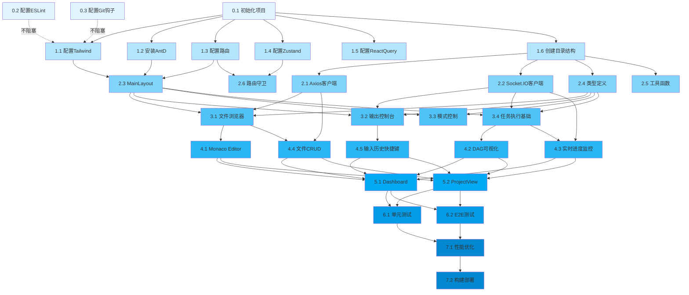

# 前端开发计划 - DAG 路线图

## 文档说明

**重要提示**：本开发计划是为 Claude Code AI 自动执行设计的 DAG（有向无环图）路线图，而非给人类开发者的时间表。

### 核心原则

1. **无时间概念**：不包含"第几天"、"何时完成"等时间安排
2. **依赖驱动**：通过依赖关系确定执行顺序
3. **最大并行度**：同一层级（Layer）内的任务可以完全并行执行
4. **层级隔离**：只有当前层级所有任务完成后，才能进入下一层级

### DAG 执行规则

```
Layer 0 任务全部完成 → 进入 Layer 1
Layer 1 任务全部完成 → 进入 Layer 2
...依此类推
```

---

## DAG 层级结构总览

### 统计信息

- **总层级数**: 7 层
- **总任务数**: 28 个任务
- **最大并行度**: 6 个任务（Layer 3）
- **关键路径长度**: 7 层

### 层级摘要

| Layer | 任务数 | 并行度 | 依赖层级 | 描述 |
|-------|--------|--------|----------|------|
| 0 | 3 | 3 | 无 | 基础设施初始化 |
| 1 | 6 | 6 | Layer 0 | 核心依赖配置 |
| 2 | 6 | 6 | Layer 1 | 基础服务实现 |
| 3 | 4 | 4 | Layer 2 | 核心业务模块 |
| 4 | 5 | 5 | Layer 3 | 高级功能实现 |
| 5 | 2 | 2 | Layer 4 | 页面整合 |
| 6 | 2 | 2 | Layer 5 | 测试与优化 |

---

## Layer 0: 基础设施层

**特点**: 无任何依赖，可完全并行执行

### Task 0.1: 初始化 Vite + React + TypeScript 项目

**任务 ID**: `frontend-0.1`

**依赖**: 无

**目标**:
- 使用 Vite 创建 React + TypeScript 项目
- 配置基础的 tsconfig.json
- 配置 vite.config.ts
- 验证项目可以成功启动

**实现步骤**:
1. 执行 `npm create vite@latest frontend -- --template react-ts`
2. 配置 `tsconfig.json`（strict mode、path aliases）
3. 配置 `vite.config.ts`（端口、代理、别名）
4. 安装基础依赖
5. 验证开发服务器可启动（`npm run dev`）

**期望输出**:
- ✅ `frontend/` 目录创建成功
- ✅ `package.json` 包含 React 18+ 和 TypeScript 5+
- ✅ `vite.config.ts` 配置完成
- ✅ `npm run dev` 可以启动开发服务器

**验证标准**:
```bash
cd frontend && npm run dev
# 应该能访问 http://localhost:5173 并看到 Vite + React 欢迎页面
```

---

### Task 0.2: 配置 ESLint + Prettier 代码规范

**任务 ID**: `frontend-0.2`

**依赖**: 无

**目标**:
- 配置 ESLint 用于代码质量检查
- 配置 Prettier 用于代码格式化
- 配置二者的集成（避免冲突）
- 添加 npm scripts

**实现步骤**:
1. 安装依赖：
   ```bash
   npm install -D eslint @typescript-eslint/parser @typescript-eslint/eslint-plugin
   npm install -D prettier eslint-config-prettier eslint-plugin-prettier
   npm install -D eslint-plugin-react eslint-plugin-react-hooks
   ```
2. 创建 `.eslintrc.cjs` 配置文件
3. 创建 `.prettierrc` 配置文件
4. 创建 `.prettierignore` 和 `.eslintignore`
5. 添加 npm scripts：`lint`、`format`

**期望输出**:
- ✅ `.eslintrc.cjs` 配置完成
- ✅ `.prettierrc` 配置完成
- ✅ `package.json` 包含 lint 和 format 脚本

**验证标准**:
```bash
npm run lint    # 应该运行 ESLint 检查
npm run format  # 应该运行 Prettier 格式化
```

---

### Task 0.3: 配置 Husky + lint-staged Git 钩子

**任务 ID**: `frontend-0.3`

**依赖**: 无

**目标**:
- 配置 Husky 管理 Git 钩子
- 配置 lint-staged 在提交前检查代码
- 确保提交的代码符合规范

**实现步骤**:
1. 初始化 Git 仓库（如果还没有）
2. 安装依赖：
   ```bash
   npm install -D husky lint-staged
   npx husky install
   ```
3. 创建 pre-commit 钩子
4. 配置 `.lintstagedrc` 或在 `package.json` 中配置
5. 添加 `prepare` script

**期望输出**:
- ✅ `.husky/pre-commit` 钩子创建
- ✅ `lint-staged` 配置完成
- ✅ Git 提交时会自动运行 lint

**验证标准**:
```bash
# 修改任意文件并提交，应该触发 lint-staged
git add .
git commit -m "test"  # 应该运行 ESLint 和 Prettier
```

---

## Layer 1: 核心依赖配置层

**特点**: 依赖 Layer 0 所有任务完成，本层内可完全并行

**前置条件**: Layer 0 全部任务完成（项目已初始化、代码规范已配置）

### Task 1.1: 配置 TailwindCSS + PostCSS

**任务 ID**: `frontend-1.1`

**依赖**: `frontend-0.1`（项目已初始化）

**目标**:
- 安装 TailwindCSS 及其依赖
- 配置 PostCSS
- 创建全局样式文件
- 配置 Tailwind 主题

**实现步骤**:
1. 安装依赖：
   ```bash
   npm install -D tailwindcss postcss autoprefixer
   npx tailwindcss init -p
   ```
2. 配置 `tailwind.config.js`（content paths、theme扩展）
3. 创建 `src/styles/tailwind.css` 并导入 Tailwind 指令
4. 在 `main.tsx` 中导入样式文件
5. 测试 Tailwind 类名是否生效

**期望输出**:
- ✅ `tailwind.config.js` 配置完成
- ✅ `postcss.config.js` 配置完成
- ✅ `src/styles/tailwind.css` 创建
- ✅ Tailwind 类名可以使用

**验证标准**:
```tsx
// 在 App.tsx 中测试
<div className="text-blue-500 font-bold">Test</div>
// 应该显示蓝色粗体文字
```

---

### Task 1.2: 安装配置 Ant Design 5.x

**任务 ID**: `frontend-1.2`

**依赖**: `frontend-0.1`（项目已初始化）

**目标**:
- 安装 Ant Design 5.x
- 配置主题定制
- 配置按需加载
- 测试组件可用性

**实现步骤**:
1. 安装依赖：
   ```bash
   npm install antd
   ```
2. 在 `main.tsx` 或 `App.tsx` 中导入 Ant Design 样式（如需要）
3. 配置主题（使用 ConfigProvider）
4. 测试几个常用组件（Button、Layout、Tree）

**期望输出**:
- ✅ `antd` 安装成功
- ✅ 主题配置完成
- ✅ Ant Design 组件可以正常渲染

**验证标准**:
```tsx
import { Button } from 'antd';
<Button type="primary">Test</Button>
// 应该显示 Ant Design 样式的按钮
```

---

### Task 1.3: 配置 React Router v6

**任务 ID**: `frontend-1.3`

**依赖**: `frontend-0.1`（项目已初始化）

**目标**:
- 安装 React Router v6
- 创建路由配置文件
- 配置基础路由结构
- 实现路由懒加载

**实现步骤**:
1. 安装依赖：
   ```bash
   npm install react-router-dom
   ```
2. 创建 `src/routes/index.tsx` 路由配置
3. 创建基础路由（Dashboard、ProjectView、Settings、NotFound）
4. 在 `App.tsx` 中使用 `RouterProvider`
5. 配置路由懒加载（使用 `React.lazy`）

**期望输出**:
- ✅ `react-router-dom` 安装成功
- ✅ `src/routes/index.tsx` 创建
- ✅ 路由可以正常导航

**验证标准**:
```tsx
// 访问不同路由应该渲染不同页面
// http://localhost:5173/dashboard
// http://localhost:5173/project/123
```

---

### Task 1.4: 配置 Zustand 状态管理

**任务 ID**: `frontend-1.4`

**依赖**: `frontend-0.1`（项目已初始化）

**目标**:
- 安装 Zustand
- 创建 store 目录结构
- 实现基础 store（AppStore、ModeStore）
- 配置 DevTools

**实现步骤**:
1. 安装依赖：
   ```bash
   npm install zustand
   npm install -D @redux-devtools/extension
   ```
2. 创建 `src/store/` 目录
3. 实现 `useAppStore.ts`（UI 状态、主题、用户）
4. 实现 `useModeStore.ts`（工作模式状态）
5. 配置 Redux DevTools 集成

**期望输出**:
- ✅ `zustand` 安装成功
- ✅ `src/store/useAppStore.ts` 创建
- ✅ `src/store/useModeStore.ts` 创建
- ✅ Store 可以正常使用

**验证标准**:
```tsx
import { useAppStore } from '@/store/useAppStore';
const { theme, setTheme } = useAppStore();
setTheme('dark'); // 应该能切换主题
```

---

### Task 1.5: 配置 React Query

**任务 ID**: `frontend-1.5`

**依赖**: `frontend-0.1`（项目已初始化）

**目标**:
- 安装 @tanstack/react-query
- 配置 QueryClient
- 创建 QueryClientProvider
- 配置 DevTools

**实现步骤**:
1. 安装依赖：
   ```bash
   npm install @tanstack/react-query
   npm install -D @tanstack/react-query-devtools
   ```
2. 创建 `src/services/query-client.ts` 配置文件
3. 在 `App.tsx` 中添加 `QueryClientProvider`
4. 配置 React Query DevTools（开发环境）
5. 设置默认缓存策略

**期望输出**:
- ✅ `@tanstack/react-query` 安装成功
- ✅ `src/services/query-client.ts` 创建
- ✅ QueryClient 配置完成
- ✅ DevTools 可以访问

**验证标准**:
```tsx
// 开发环境应该能看到 React Query DevTools 浮动按钮
```

---

### Task 1.6: 创建项目目录结构

**任务 ID**: `frontend-1.6`

**依赖**: `frontend-0.1`（项目已初始化）

**目标**:
- 创建标准化的目录结构
- 添加 README 和索引文件
- 配置路径别名
- 创建类型定义文件

**实现步骤**:
1. 创建以下目录结构：
   ```
   src/
   ├── assets/
   ├── components/
   │   ├── common/
   │   ├── layout/
   │   └── business/
   ├── pages/
   ├── features/
   │   ├── file-explorer/
   │   ├── output-console/
   │   ├── mode-control/
   │   └── task-execution/
   ├── store/
   ├── services/
   │   ├── api/
   │   └── websocket/
   ├── hooks/
   ├── utils/
   ├── types/
   ├── constants/
   ├── styles/
   └── tests/
   ```
2. 在每个目录下创建 `index.ts` 导出文件
3. 配置 `tsconfig.json` 路径别名（`@/` -> `src/`）
4. 创建 `src/types/global.d.ts` 全局类型定义
5. 创建 `src/vite-env.d.ts` Vite 类型声明

**期望输出**:
- ✅ 目录结构创建完成
- ✅ 路径别名配置完成（可以使用 `@/components`）
- ✅ 类型定义文件创建

**验证标准**:
```tsx
// 可以使用路径别名导入
import { Something } from '@/components/common';
// TypeScript 不会报错
```

---

## Layer 2: 基础服务层

**特点**: 依赖 Layer 1 所有任务完成，本层内可完全并行

**前置条件**: Layer 1 全部任务完成（核心依赖已配置、目录结构已创建）

### Task 2.1: 实现 Axios HTTP 客户端封装

**任务 ID**: `frontend-2.1`

**依赖**: `frontend-1.6`（目录结构已创建）

**目标**:
- 安装 Axios
- 封装 HTTP 客户端
- 配置请求/响应拦截器
- 实现错误处理

**实现步骤**:
1. 安装依赖：
   ```bash
   npm install axios
   ```
2. 创建 `src/services/api/http-client.ts`
3. 实现以下功能：
   - 基础 URL 配置（从环境变量读取）
   - 请求拦截器（添加 token、通用 headers）
   - 响应拦截器（错误处理、数据转换）
   - 超时配置
   - 请求取消功能
4. 创建类型定义 `src/types/api.types.ts`

**期望输出**:
- ✅ `src/services/api/http-client.ts` 创建
- ✅ 拦截器配置完成
- ✅ 类型定义完成

**验证标准**:
```tsx
import { httpClient } from '@/services/api/http-client';
const response = await httpClient.get('/api/test');
// 应该能正常发起请求
```

---

### Task 2.2: 实现 Socket.IO WebSocket 客户端封装

**任务 ID**: `frontend-2.2`

**依赖**: `frontend-1.6`（目录结构已创建）

**目标**:
- 安装 Socket.IO Client
- 封装 WebSocket 客户端
- 实现自动重连
- 实现事件类型定义

**实现步骤**:
1. 安装依赖：
   ```bash
   npm install socket.io-client
   ```
2. 创建 `src/services/websocket/socket-client.ts`
3. 实现以下功能：
   - 连接管理（connect、disconnect）
   - 事件订阅/取消订阅
   - 自动重连配置
   - 心跳检测
   - 连接状态管理
4. 创建 `src/types/socket-events.ts` 事件类型定义
5. 实现 React Hook：`src/hooks/useWebSocket.ts`

**期望输出**:
- ✅ `src/services/websocket/socket-client.ts` 创建
- ✅ `src/hooks/useWebSocket.ts` 创建
- ✅ WebSocket 可以正常连接

**验证标准**:
```tsx
import { useWebSocket } from '@/hooks/useWebSocket';
const { connected, emit, subscribe } = useWebSocket();
// connected 应该为 true（连接成功）
```

---

### Task 2.3: 实现 MainLayout 布局组件

**任务 ID**: `frontend-2.3`

**依赖**: `frontend-1.2`（Ant Design 已安装）、`frontend-1.1`（TailwindCSS 已配置）、`frontend-1.3`（路由已配置）

**目标**:
- 实现三栏布局（左侧文件树、右上输出、右下控制）
- 使用 Ant Design Layout 组件
- 实现响应式布局
- 支持侧边栏折叠

**实现步骤**:
1. 创建 `src/components/layout/MainLayout/MainLayout.tsx`
2. 使用 Ant Design 的 Layout、Sider、Header、Content 组件
3. 实现三栏布局结构：
   - 左侧 Sider（20-30% 宽度）
   - 右侧 Content 分为上下两部分（Split Panel）
4. 实现侧边栏折叠功能（关联 Zustand store）
5. 添加样式（CSS Modules 或 TailwindCSS）
6. 创建 Header 组件（显示标题、用户信息）

**期望输出**:
- ✅ `src/components/layout/MainLayout/` 目录创建
- ✅ 三栏布局实现
- ✅ 响应式适配
- ✅ 侧边栏可折叠

**验证标准**:
```tsx
<MainLayout>
  <div>Content</div>
</MainLayout>
// 应该显示三栏布局
```

---

### Task 2.4: 定义全局 TypeScript 类型

**任务 ID**: `frontend-2.4`

**依赖**: `frontend-1.6`（目录结构已创建）

**目标**:
- 定义核心业务类型
- 定义 API 接口类型
- 定义组件 Props 类型
- 定义常量枚举

**实现步骤**:
1. 创建 `src/types/file.types.ts`（文件相关类型）
2. 创建 `src/types/task.types.ts`（任务相关类型）
3. 创建 `src/types/mode.types.ts`（模式相关类型）
4. 创建 `src/types/api.types.ts`（API 请求/响应类型）
5. 创建 `src/types/global.d.ts`（全局类型声明）

**类型定义示例**:
```typescript
// file.types.ts
export interface FileNode {
  id: string;
  name: string;
  type: 'file' | 'directory';
  path: string;
  children?: FileNode[];
  size?: number;
  modified?: Date;
}

// task.types.ts
export interface Task {
  id: string;
  layer: number;
  name: string;
  status: 'pending' | 'running' | 'completed' | 'failed';
  dependencies: string[];
}

// mode.types.ts
export enum WorkMode {
  PRD = 'prd',
  ARCHITECTURE = 'architecture',
  DEV_PLAN = 'dev_plan',
  TASK_GEN = 'task_gen',
  TASK_EXEC = 'task_exec',
  LOOP_TEST = 'loop_test',
  DEPLOY = 'deploy'
}
```

**期望输出**:
- ✅ 所有类型定义文件创建
- ✅ 类型导出正确
- ✅ TypeScript 编译无错误

**验证标准**:
```tsx
import { FileNode, Task, WorkMode } from '@/types';
// TypeScript 能正确识别类型
```

---

### Task 2.5: 实现通用工具函数

**任务 ID**: `frontend-2.5`

**依赖**: `frontend-1.6`（目录结构已创建）

**目标**:
- 实现格式化工具
- 实现验证工具
- 实现文件处理工具
- 实现 DAG 处理工具

**实现步骤**:
1. 创建 `src/utils/format.ts`：
   - 日期格式化
   - 文件大小格式化
   - 时长格式化
2. 创建 `src/utils/validation.ts`：
   - 文件名验证
   - 路径验证
   - 输入验证
3. 创建 `src/utils/file.ts`：
   - 获取文件扩展名
   - 获取文件图标
   - 文件类型判断
4. 创建 `src/utils/dag.ts`：
   - DAG 解析
   - 拓扑排序
   - 依赖关系检查
5. 添加单元测试（可选）

**期望输出**:
- ✅ `src/utils/` 下工具函数创建
- ✅ 所有函数有 TypeScript 类型注解
- ✅ 导出正确

**验证标准**:
```tsx
import { formatFileSize, getFileIcon } from '@/utils/file';
formatFileSize(1024); // "1 KB"
getFileIcon('test.ts'); // 返回 TypeScript 图标
```

---

### Task 2.6: 实现路由配置和守卫

**任务 ID**: `frontend-2.6`

**依赖**: `frontend-1.3`（React Router 已配置）、`frontend-1.4`（Zustand 已配置）

**目标**:
- 完善路由配置
- 实现路由守卫（鉴权）
- 实现 404 页面
- 配置路由常量

**实现步骤**:
1. 创建 `src/constants/routes.ts`（路由常量）
2. 完善 `src/routes/index.tsx`（添加所有路由）
3. 创建 `src/components/RouteGuard.tsx`（路由守卫组件）
4. 创建 `src/pages/NotFound/NotFound.tsx`（404 页面）
5. 实现登录检查逻辑（从 Zustand store 读取用户状态）
6. 添加路由元信息（title、requireAuth 等）

**期望输出**:
- ✅ 路由守卫实现
- ✅ 404 页面创建
- ✅ 未登录用户自动重定向到登录页

**验证标准**:
```tsx
// 未登录访问需要鉴权的页面，应该重定向到 /login
// 访问不存在的路由，应该显示 404 页面
```

---

## Layer 3: 核心业务模块层

**特点**: 依赖 Layer 2 所有任务完成，本层内可完全并行

**前置条件**: Layer 2 全部任务完成（布局、HTTP 客户端、WebSocket、类型定义都已完成）

### Task 3.1: 实现文件浏览器模块（FileExplorer）

**任务 ID**: `frontend-3.1`

**依赖**: `frontend-2.3`（布局已完成）、`frontend-2.1`（HTTP 客户端已完成）、`frontend-2.4`（类型定义已完成）

**目标**:
- 实现文件树组件
- 实现文件节点展开/折叠
- 实现文件搜索
- 实现右键菜单（基础）
- 集成 Ant Design Tree 组件

**实现步骤**:
1. 创建 `src/features/file-explorer/` 目录结构
2. 实现 `components/FileTree.tsx`（主组件）
3. 实现 `components/FileTreeNode.tsx`（树节点组件）
4. 实现 `components/FileSearchBar.tsx`（搜索栏）
5. 实现 `components/FileIcon.tsx`（文件图标组件）
6. 实现 `hooks/useFileTree.ts`（文件树逻辑 Hook）
7. 实现 `services/file.service.ts`（文件 API 调用）
8. 创建 `types.ts`（模块类型定义）
9. 使用 React Query 缓存文件树数据

**期望输出**:
- ✅ 文件树可以正常渲染
- ✅ 目录可以展开/折叠
- ✅ 搜索功能可用
- ✅ 文件图标显示正确

**验证标准**:
```tsx
<FileTree rootPath="/project" />
// 应该显示文件树，可以展开目录
```

---

### Task 3.2: 实现输出控制台模块（OutputConsole）

**任务 ID**: `frontend-3.2`

**依赖**: `frontend-2.3`（布局已完成）、`frontend-2.2`（WebSocket 已完成）、`frontend-2.4`（类型定义已完成）

**目标**:
- 实现输出显示区
- 实现实时流式输出
- 实现输入框
- 实现自动滚动
- 集成 WebSocket 接收输出

**实现步骤**:
1. 创建 `src/features/output-console/` 目录结构
2. 实现 `components/OutputConsole.tsx`（主组件）
3. 实现 `components/OutputDisplay.tsx`（输出显示区）
4. 实现 `components/InputArea.tsx`（输入区域）
5. 实现 `components/OutputToolbar.tsx`（工具栏：清空、导出、搜索）
6. 实现 `hooks/useOutputStream.ts`（输出流处理）
7. 实现 `hooks/useAutoScroll.ts`（自动滚动逻辑）
8. 创建 `types.ts`（输出消息类型）
9. 集成 WebSocket 监听 `output:stream` 事件

**期望输出**:
- ✅ 输出区可以显示消息
- ✅ 实时流式输出工作正常
- ✅ 输入框可以发送 Prompt
- ✅ 自动滚动到底部

**验证标准**:
```tsx
<OutputConsole />
// 应该显示输出区和输入框
// WebSocket 收到消息时应该实时显示
```

---

### Task 3.3: 实现模式控制模块（ModeControl）

**任务 ID**: `frontend-3.3`

**依赖**: `frontend-2.3`（布局已完成）、`frontend-1.4`（Zustand 已配置）、`frontend-2.4`（类型定义已完成）

**目标**:
- 实现模式面板
- 实现 7 种工作模式按钮
- 实现模式切换
- 实现进度显示
- 实现快捷操作

**实现步骤**:
1. 创建 `src/features/mode-control/` 目录结构
2. 实现 `components/ModePanel.tsx`（模式面板主组件）
3. 实现 `components/ModeButton.tsx`（单个模式按钮）
4. 实现 `components/ProgressBar.tsx`（进度条组件）
5. 实现 `components/QuickActions.tsx`（快捷操作按钮组）
6. 实现 `hooks/useModeControl.ts`（模式控制逻辑）
7. 创建 `src/constants/modes.ts`（模式配置常量）
8. 集成 `useModeStore`（从 Zustand 读取/更新状态）

**模式配置示例**:
```typescript
const MODES: ModeConfig[] = [
  {
    id: WorkMode.PRD,
    name: '编写 PRD',
    icon: '📝',
    color: '#1890ff',
    description: '创建产品需求文档'
  },
  // ... 其他 6 个模式
];
```

**期望输出**:
- ✅ 模式面板显示 7 个模式
- ✅ 点击模式可以切换
- ✅ 当前模式高亮显示
- ✅ 进度条显示正确

**验证标准**:
```tsx
<ModePanel />
// 应该显示 7 个模式按钮
// 点击后 Zustand store 中的 currentMode 应该更新
```

---

### Task 3.4: 实现任务执行模块基础（TaskExecution 基础）

**任务 ID**: `frontend-3.4`

**依赖**: `frontend-2.3`（布局已完成）、`frontend-2.2`（WebSocket 已完成）、`frontend-2.4`（类型定义已完成）

**目标**:
- 实现任务仪表板
- 实现任务列表显示
- 实现任务状态实时更新
- 实现层级进度显示

**实现步骤**:
1. 创建 `src/features/task-execution/` 目录结构
2. 实现 `components/TaskDashboard.tsx`（任务仪表板）
3. 实现 `components/TaskCard.tsx`（单个任务卡片）
4. 实现 `components/LayerProgress.tsx`（层级进度组件）
5. 实现 `hooks/useTaskExecution.ts`（任务执行逻辑）
6. 实现 `hooks/useTaskMonitor.ts`（任务监控 Hook）
7. 创建 `types.ts`（任务类型定义）
8. 集成 WebSocket 监听任务状态更新

**期望输出**:
- ✅ 任务仪表板可以显示
- ✅ 任务列表按层级分组
- ✅ 任务状态实时更新
- ✅ 层级进度条显示正确

**验证标准**:
```tsx
<TaskDashboard />
// 应该显示任务列表，按 Layer 分组
// WebSocket 推送任务状态更新时，UI 应该实时刷新
```

---

## Layer 4: 高级功能层

**特点**: 依赖 Layer 3 所有任务完成，本层内可完全并行

**前置条件**: Layer 3 全部任务完成（核心业务模块都已实现）

### Task 4.1: 集成 Monaco Editor 到文件浏览器

**任务 ID**: `frontend-4.1`

**依赖**: `frontend-3.1`（文件浏览器已实现）

**目标**:
- 安装 Monaco Editor
- 实现代码编辑器组件
- 集成到文件浏览器
- 实现文件内容读取和保存
- 配置语法高亮

**实现步骤**:
1. 安装依赖：
   ```bash
   npm install @monaco-editor/react monaco-editor
   ```
2. 创建 `src/components/business/CodeEditor/CodeEditor.tsx`
3. 配置 Monaco Editor 选项（主题、语言、只读等）
4. 在文件浏览器中集成：点击文件打开编辑器
5. 实现文件内容加载（通过 HTTP API）
6. 实现文件保存功能
7. 配置常见语言的语法高亮（TypeScript、JavaScript、Markdown 等）

**期望输出**:
- ✅ Monaco Editor 组件创建
- ✅ 点击文件可以打开编辑器
- ✅ 语法高亮正确
- ✅ 可以编辑和保存文件

**验证标准**:
```tsx
// 在文件树中点击 .ts 文件
// 应该打开 Monaco Editor 并显示文件内容，支持 TypeScript 高亮
```

---

### Task 4.2: 实现 Mermaid DAG 可视化

**任务 ID**: `frontend-4.2`

**依赖**: `frontend-3.4`（任务执行模块已实现）

**目标**:
- 安装 Mermaid.js
- 实现 DAG 图表组件
- 解析 tasks-index.json 生成 Mermaid 语法
- 实现交互功能（节点点击、高亮）

**实现步骤**:
1. 安装依赖：
   ```bash
   npm install mermaid
   ```
2. 创建 `src/features/task-execution/components/DAGVisualization.tsx`
3. 实现 Mermaid 图表渲染
4. 实现 `hooks/useDAGParser.ts`（解析 tasks-index.json）
5. 生成 Mermaid 语法：
   ```
   graph TD
     1.1[Task 1.1] --> 2.1[Task 2.1]
     1.2[Task 1.2] --> 2.1
   ```
6. 实现节点状态着色（pending、running、completed、failed）
7. 实现节点点击事件（显示任务详情）

**期望输出**:
- ✅ DAG 图表组件创建
- ✅ 可以正确渲染依赖关系图
- ✅ 节点颜色反映任务状态
- ✅ 点击节点显示详情

**验证标准**:
```tsx
<DAGVisualization taskIndex={taskIndex} />
// 应该渲染 DAG 图表
// 不同状态的任务节点显示不同颜色
```

---

### Task 4.3: 实现任务实时进度监控

**任务 ID**: `frontend-4.3`

**依赖**: `frontend-3.4`（任务执行模块已实现）、`frontend-2.2`（WebSocket 已完成）

**目标**:
- 实现实时进度条
- 实现任务执行日志
- 实现层级完成通知
- 实现错误提示

**实现步骤**:
1. 在 `src/features/task-execution/` 下创建组件：
   - `components/ExecutionProgress.tsx`（总体进度）
   - `components/ExecutionLog.tsx`（执行日志）
   - `components/TaskStatusBadge.tsx`（任务状态徽章）
2. 实现 WebSocket 事件监听：
   - `task:status`（任务状态更新）
   - `layer:completed`（层级完成）
   - `task:progress`（任务进度）
3. 实现进度计算逻辑（已完成/总任务数）
4. 实现日志滚动显示
5. 集成 Ant Design 的 Progress、Timeline、Badge 组件

**期望输出**:
- ✅ 总体进度条显示正确
- ✅ 实时日志滚动显示
- ✅ 任务状态实时更新
- ✅ 层级完成有通知提示

**验证标准**:
```tsx
<ExecutionProgress />
// 应该显示当前执行进度（如 5/10 任务完成，50%）
// 任务状态变化时实时更新
```

---

### Task 4.4: 实现文件操作功能（CRUD）

**任务 ID**: `frontend-4.4`

**依赖**: `frontend-3.1`（文件浏览器已实现）、`frontend-2.1`（HTTP 客户端已完成）

**目标**:
- 实现文件右键菜单完整功能
- 实现新建文件/目录
- 实现删除文件/目录
- 实现重命名文件/目录
- 实现文件上传

**实现步骤**:
1. 完善 `src/features/file-explorer/components/FileContextMenu.tsx`
2. 实现菜单项：
   - 新建文件
   - 新建目录
   - 重命名
   - 删除
   - 复制路径
   - 在编辑器中打开
3. 实现对应的 Modal 对话框（使用 Ant Design Modal）
4. 在 `file.service.ts` 中实现 API 调用：
   - `createFile(path, content)`
   - `createDirectory(path)`
   - `deleteFile(path)`
   - `renameFile(oldPath, newPath)`
5. 实现操作后刷新文件树（React Query invalidate）

**期望输出**:
- ✅ 右键菜单显示完整功能
- ✅ 可以新建/删除/重命名文件
- ✅ 操作后文件树自动刷新
- ✅ 错误处理友好

**验证标准**:
```tsx
// 右键点击文件树节点
// 应该显示菜单，可以执行 CRUD 操作
// 操作成功后文件树应该更新
```

---

### Task 4.5: 实现输入历史和快捷键

**任务 ID**: `frontend-4.5`

**依赖**: `frontend-3.2`（输出控制台已实现）

**目标**:
- 实现输入历史记录
- 实现上下箭头切换历史
- 实现快捷键支持（Ctrl+Enter 提交等）
- 实现输入自动补全（可选）

**实现步骤**:
1. 创建 `src/features/output-console/hooks/useInputHistory.ts`
2. 实现历史记录存储（localStorage）
3. 实现上下箭头切换历史（useEffect 监听键盘事件）
4. 实现 `src/hooks/useKeyboard.ts`（通用快捷键 Hook）
5. 配置快捷键：
   - `Ctrl+Enter`: 提交 Prompt
   - `Ctrl+L`: 清空输出
   - `Ctrl+K`: 聚焦输入框
6. 实现输入建议（基于历史记录）

**期望输出**:
- ✅ 输入历史可以保存和切换
- ✅ 快捷键功能正常
- ✅ 用户体验流畅

**验证标准**:
```tsx
// 在输入框中输入并提交
// 按上箭头应该显示上一条输入
// Ctrl+Enter 应该提交当前输入
```

---

## Layer 5: 页面整合层

**特点**: 依赖 Layer 4 所有任务完成，本层内可并行

**前置条件**: Layer 4 全部任务完成（所有功能模块都已完成）

### Task 5.1: 实现 Dashboard 主页面

**任务 ID**: `frontend-5.1`

**依赖**: Layer 4 全部任务（所有功能模块已完成）

**目标**:
- 实现项目列表页面
- 实现项目创建
- 实现项目卡片
- 实现快速导航

**实现步骤**:
1. 创建 `src/pages/Dashboard/Dashboard.tsx`
2. 实现项目列表展示（使用 Ant Design Card 或 Table）
3. 实现"创建项目"按钮和 Modal
4. 实现项目卡片组件（显示项目信息、状态、进度）
5. 实现项目搜索和过滤
6. 集成 React Query 获取项目列表
7. 实现点击项目跳转到 ProjectView

**期望输出**:
- ✅ Dashboard 页面显示项目列表
- ✅ 可以创建新项目
- ✅ 可以搜索和过滤项目
- ✅ 点击项目进入详情页

**验证标准**:
```tsx
// 访问 /dashboard
// 应该显示项目列表
// 点击"创建项目"应该弹出 Modal
```

---

### Task 5.2: 实现 ProjectView 项目视图页面

**任务 ID**: `frontend-5.2`

**依赖**: Layer 4 全部任务（所有功能模块已完成）

**目标**:
- 整合所有功能模块到项目视图
- 实现三栏布局
- 实现模块间通信
- 实现状态同步

**实现步骤**:
1. 创建 `src/pages/ProjectView/ProjectView.tsx`
2. 使用 MainLayout 布局
3. 在三个区域分别放置：
   - 左侧：FileExplorer
   - 右上：OutputConsole
   - 右下：ModePanel + TaskDashboard（Tab 切换）
4. 实现模块间状态同步（通过 Zustand）
5. 实现面板大小调整（使用 react-split 或自定义）
6. 实现快捷操作栏（顶部工具栏）
7. 集成 WebSocket（连接到项目对应的房间）

**期望输出**:
- ✅ 项目视图页面整合所有模块
- ✅ 三栏布局显示正确
- ✅ 模块间可以通信
- ✅ WebSocket 连接到对应项目

**验证标准**:
```tsx
// 访问 /project/123
// 应该显示完整的三栏布局
// 文件浏览器、输出控制台、模式控制都正常工作
```

---

## Layer 6: 测试与优化层

**特点**: 依赖 Layer 5 所有任务完成，本层内可并行

**前置条件**: Layer 5 全部任务完成（页面已整合）

### Task 6.1: 编写核心模块单元测试

**任务 ID**: `frontend-6.1`

**依赖**: Layer 5 全部任务（页面已整合）

**目标**:
- 安装测试框架
- 编写核心组件单元测试
- 编写工具函数测试
- 配置测试覆盖率

**实现步骤**:
1. 安装依赖：
   ```bash
   npm install -D vitest @testing-library/react @testing-library/jest-dom
   npm install -D @testing-library/user-event jsdom
   ```
2. 配置 `vitest.config.ts`
3. 编写测试文件：
   - `src/utils/__tests__/format.test.ts`
   - `src/utils/__tests__/file.test.ts`
   - `src/components/business/FileTree/__tests__/FileTree.test.tsx`
   - `src/features/mode-control/__tests__/ModePanel.test.tsx`
4. 配置测试覆盖率报告
5. 添加 npm script：`npm run test`

**期望输出**:
- ✅ 单元测试可以运行
- ✅ 核心模块测试覆盖率 > 70%
- ✅ 所有测试通过

**验证标准**:
```bash
npm run test
# 应该运行所有测试并显示结果
```

---

### Task 6.2: 编写 E2E 测试用例

**任务 ID**: `frontend-6.2`

**依赖**: Layer 5 全部任务（页面已整合）

**目标**:
- 安装 Playwright
- 编写端到端测试
- 测试完整工作流
- 配置 CI/CD 集成

**实现步骤**:
1. 安装依赖：
   ```bash
   npm install -D @playwright/test
   npx playwright install
   ```
2. 配置 `playwright.config.ts`
3. 编写 E2E 测试：
   - `tests/e2e/dashboard.spec.ts`（Dashboard 测试）
   - `tests/e2e/file-explorer.spec.ts`（文件浏览器测试）
   - `tests/e2e/task-execution.spec.ts`（任务执行测试）
   - `tests/e2e/workflow.spec.ts`（完整工作流测试）
4. 添加 npm script：`npm run test:e2e`

**期望输出**:
- ✅ E2E 测试可以运行
- ✅ 关键流程测试通过
- ✅ 测试报告生成

**验证标准**:
```bash
npm run test:e2e
# 应该启动浏览器并执行测试
```

---

## Layer 7: 最终优化层

**特点**: 依赖 Layer 6 所有任务完成

**前置条件**: Layer 6 全部任务完成（测试已完成）

### Task 7.1: 性能优化

**任务 ID**: `frontend-7.1`

**依赖**: Layer 6 全部任务（测试已完成）

**目标**:
- 实现代码分割
- 实现懒加载
- 实现虚拟滚动
- 优化打包体积

**实现步骤**:
1. 配置路由懒加载（React.lazy + Suspense）
2. 实现文件树虚拟滚动（react-window）：
   ```bash
   npm install react-window
   ```
3. 优化 Vite 构建配置：
   - 配置 manualChunks（拆分 vendor）
   - 配置 chunkSizeWarningLimit
   - 配置 terser 压缩
4. 实现组件级 Code Splitting
5. 添加 Loading 组件和骨架屏
6. 优化图片（懒加载、WebP 格式）
7. 分析打包体积（rollup-plugin-visualizer）

**期望输出**:
- ✅ 首屏加载时间 < 3s
- ✅ 打包体积减小 30%+
- ✅ 大文件树渲染流畅

**验证标准**:
```bash
npm run build
npm run preview
# Lighthouse 性能评分 > 90
```

---

### Task 7.2: 生产构建配置和部署文档

**任务 ID**: `frontend-7.2`

**依赖**: `frontend-7.1`（性能优化已完成）

**目标**:
- 完善生产构建配置
- 配置环境变量
- 编写部署文档
- 配置 Nginx

**实现步骤**:
1. 完善 `vite.config.ts` 生产配置
2. 创建 `.env.production` 环境变量文件
3. 配置打包优化选项
4. 创建 `nginx.conf` 示例配置
5. 编写 `README.md` 部署文档
6. 创建 Dockerfile（可选）
7. 测试生产构建

**期望输出**:
- ✅ 生产构建配置完成
- ✅ 部署文档完整
- ✅ Nginx 配置示例
- ✅ 生产构建可以运行

**验证标准**:
```bash
npm run build
npm run preview
# 生产构建可以正常运行
```

---

## DAG 依赖关系图

### 完整 DAG 可视化



### 关键路径分析

**关键路径**（决定最短完成时间的路径）:
```
0.1 → 1.6 → 2.3 → 3.4 → 4.3 → 5.2 → 6.2 → 7.1 → 7.2
```

**路径长度**: 9 步（7 层）

**并行度分析**:
- Layer 0: 最多 3 个任务并行
- Layer 1: 最多 6 个任务并行 ⭐（最大并行度）
- Layer 2: 最多 6 个任务并行 ⭐（最大并行度）
- Layer 3: 最多 4 个任务并行
- Layer 4: 最多 5 个任务并行
- Layer 5: 最多 2 个任务并行
- Layer 6: 最多 2 个任务并行
- Layer 7: 串行执行

---

## 并行度与依赖关系说明

### Layer 0 的并行性

✅ **可以完全并行**，因为：
- `0.1 初始化项目` 和 `0.2 配置 ESLint` 都是独立的初始化操作
- `0.3 配置 Git 钩子` 不依赖前两者
- 它们之间没有任何文件或配置依赖

### Layer 1 的并行性

✅ **可以完全并行**，因为：
- 所有任务都只依赖 `0.1 初始化项目`
- TailwindCSS、Ant Design、Router、Zustand、React Query 的配置互不影响
- 创建目录结构也是独立操作

### Layer 2 的并行性

✅ **可以完全并行**，因为：
- HTTP 客户端 和 WebSocket 客户端是独立模块
- MainLayout 依赖 Ant Design 和路由，但不依赖其他 Layer 2 任务
- 类型定义和工具函数也是独立的
- 虽然有不同的依赖，但都来自 Layer 1，没有 Layer 2 内部依赖

### Layer 3 的并行性

✅ **可以完全并行**，因为：
- 文件浏览器、输出控制台、模式控制、任务执行是四个独立的功能模块
- 它们各自依赖的 Layer 2 组件已全部完成
- 模块间通过 props 或 Zustand 通信，不存在实现时的硬依赖

### Layer 4 的并行性

✅ **可以完全并行**，因为：
- Monaco Editor 集成只影响文件浏览器
- DAG 可视化只影响任务执行模块
- 实时进度监控也只影响任务执行模块
- 文件 CRUD 操作只影响文件浏览器
- 输入历史快捷键只影响输出控制台
- 这些都是对现有模块的增强，相互独立

### Layer 5 的依赖关系

⚠️ **部分并行**：
- Dashboard 和 ProjectView 可以并行开发
- 但它们都需要等待 Layer 4 全部完成，因为它们是对所有功能的整合

### Layer 6 的并行性

✅ **可以并行**：
- 单元测试和 E2E 测试可以同时编写
- 它们都是对已完成功能的测试，互不影响

### Layer 7 的串行性

❌ **必须串行**：
- 7.2 依赖 7.1，因为部署配置需要基于优化后的构建

---

## 执行策略建议

### 自动化执行流程

```python
for layer_num in range(8):  # Layer 0 到 Layer 7
    layer_tasks = get_tasks_in_layer(layer_num)

    print(f"开始执行 Layer {layer_num} ({len(layer_tasks)} 个并行任务)")

    # 并行执行同层所有任务
    results = await execute_tasks_parallel(layer_tasks)

    # 检查是否有失败
    if any(r.status == 'failed' for r in results):
        handle_failure(layer_num, results)
        break  # 停止执行后续层

    print(f"Layer {layer_num} 全部完成 ✅")

print("前端开发完成！🎉")
```

### 失败处理策略

1. **任务失败时**：
   - 停止当前层的其他任务（可选）
   - 记录详细错误日志
   - 提供重试选项
   - 允许跳过失败任务继续（谨慎使用）

2. **层级失败时**：
   - 暂停执行后续层
   - 显示失败任务列表
   - 等待人工介入或自动修复

---

## 验收标准

### Layer 0 验收
- [ ] `npm run dev` 可以启动项目
- [ ] `npm run lint` 可以执行代码检查
- [ ] Git commit 触发 pre-commit 钩子

### Layer 1 验收
- [ ] Tailwind 类名生效
- [ ] Ant Design 组件可以渲染
- [ ] 路由导航正常
- [ ] Zustand store 可以使用
- [ ] React Query 可以发起查询

### Layer 2 验收
- [ ] HTTP 请求可以发送
- [ ] WebSocket 可以连接
- [ ] 布局组件显示正常
- [ ] 类型定义无错误
- [ ] 路径别名 `@/` 可用

### Layer 3 验收
- [ ] 文件树可以展示
- [ ] 输出控制台可以接收消息
- [ ] 模式切换功能正常
- [ ] 任务列表可以显示

### Layer 4 验收
- [ ] Monaco Editor 可以编辑文件
- [ ] DAG 图表正确渲染
- [ ] 实时进度更新
- [ ] 文件 CRUD 操作成功
- [ ] 快捷键生效

### Layer 5 验收
- [ ] Dashboard 显示项目列表
- [ ] ProjectView 整合所有模块
- [ ] 页面间导航流畅

### Layer 6 验收
- [ ] 单元测试覆盖率 > 70%
- [ ] E2E 测试关键流程通过

### Layer 7 验收
- [ ] Lighthouse 性能评分 > 90
- [ ] 生产构建成功
- [ ] 部署文档完整

---

## 总结

### 设计要点

1. ✅ **无时间概念**：只有依赖关系，没有日期
2. ✅ **最大并行度**：Layer 1 和 Layer 2 各有 6 个任务可并行
3. ✅ **依赖关系清晰**：每个任务明确列出依赖的前置任务
4. ✅ **层级分明**：7 层结构，每层职责明确
5. ✅ **可验证性**：每个任务都有验证标准

### DAG 特性

- **总任务数**: 28
- **总层数**: 7
- **最大并行度**: 6（Layer 1 和 Layer 2）
- **关键路径长度**: 9 步
- **平均并行度**: 3.5

### 执行预期

假设单个任务平均执行时间为 T：
- **串行执行总时间**: 28T
- **并行执行总时间**: 约 9T（基于关键路径）
- **效率提升**: 约 3.1 倍

---

**文档版本**: 1.0
**创建日期**: 2024-01-20
**适用于**: Claude Code AI 自动执行
**执行引擎**: DAG 任务调度器
