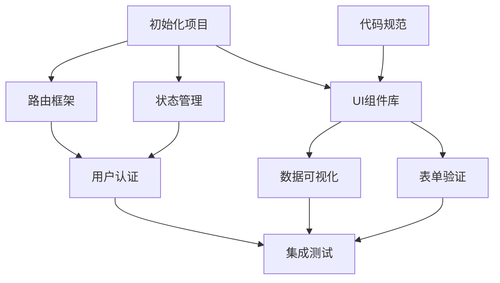
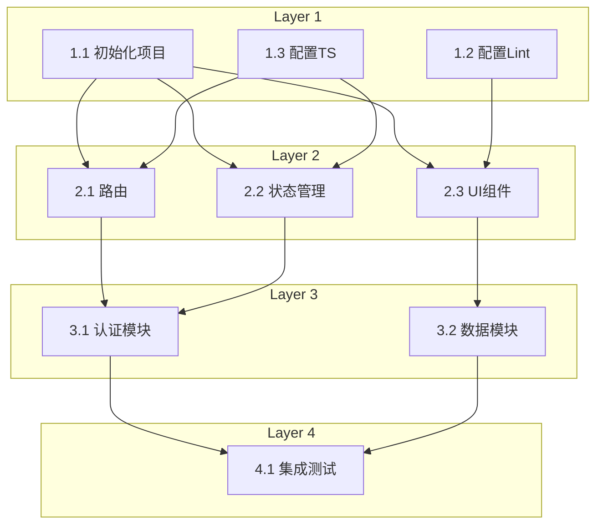

# Claude Code Harness - 产品需求文档 (PRD)

## 1. 产品概述

### 1.1 产品名称
Claude Code Harness - 基于Claude Code Headless模式的自动化软件开发平台

### 1.2 产品定位
一个通过Web界面调用Claude Code headless模式（`claude -p`）的自动化开发工具，实现从需求文档到生产部署的全流程自动化开发。

### 1.3 目标用户
- 软件开发团队
- 产品经理
- 技术架构师
- DevOps工程师

### 1.4 核心价值
- 自动化软件开发全生命周期
- 基于DAG的智能任务编排和执行
- 持续集成的测试和修复循环
- 一键部署到生产环境

---

## 2. 功能需求

### 2.1 用户界面布局

#### 2.1.1 整体布局
Web界面采用三栏式布局：
- **左侧栏**：文件浏览器（占宽20-30%）
- **右上区**：输入回显区（占右侧50-60%高度）
- **右下区**：功能按钮和模式显示区（占右侧40-50%高度）

#### 2.1.2 左侧 - 文件浏览器
**功能说明**：
- 类似VSCode的文件树结构
- 显示项目的所有文件和目录

**交互需求**：
- 目录可展开/折叠
- 点击目录查看内部文件和子目录
- 点击文件可预览或编辑
- 支持文件/目录的搜索和过滤
- 显示文件类型图标
- 支持右键菜单（创建、删除、重命名等）

**技术要求**：
- 实时监听文件系统变化
- 支持大量文件的虚拟滚动
- 文件树状态持久化

#### 2.1.3 右上 - 输入回显区
**功能说明**：
分为上下两部分：

**上半部分 - 输出回显**：
- 显示后台Claude Code (`claude -p`) 的执行返回
- 实时流式输出
- 支持多种输出格式（文本、代码、Markdown等）
- 语法高亮显示
- 可滚动查看历史输出
- 支持输出内容的搜索和复制

**下半部分 - 输入框**：
- Prompt输入区域
- 支持多行文本输入
- 支持Markdown格式
- 提供输入历史记录
- 快捷键支持（Ctrl+Enter提交等）
- 输入建议和自动补全

**技术要求**：
- WebSocket实时通信
- 支持大量输出内容的性能优化
- 输出内容可导出

#### 2.1.4 右下 - 功能按钮和模式显示区
**功能说明**：
- 显示当前工作模式
- 提供模式切换按钮
- 显示任务执行进度
- 提供快捷操作按钮

---

### 2.2 工作模式

#### 2.2.1 模式1：编写PRD文档
**功能**：
- 创建和编辑产品需求文档
- 支持模板选择
- 提供PRD编写指导
- 支持AI辅助编写

**输入**：
- 用户的需求描述
- 产品特性列表

**输出**：
- 结构化的PRD文档（Markdown格式）
- 存储路径：`context/prd/prd.md`

**Claude调用**：
```bash
claude -p "根据以下需求编写PRD文档: {user_input}"
```

#### 2.2.2 模式2：生成架构文档
**功能**：
- 根据PRD自动生成技术架构文档
- 包含系统架构图
- 技术栈选择
- 模块划分
- **前后端分离识别**：自动判断是否需要分离前后端

**输入**：
- PRD文档内容

**输出**：
- 架构设计文档（Markdown格式）
- 架构图（Mermaid或其他格式）
- 存储路径：
  - 单体项目：`context/architecture/architecture.md`
  - 前后端分离：
    - `context/architecture/frontend/frontend-architecture.md`
    - `context/architecture/backend/backend-architecture.md`

**Claude调用**：
```bash
claude -p "根据PRD文档生成架构设计，判断是否需要前后端分离: {prd_content}"
```

#### 2.2.3 模式3：生成开发计划文档（DAG路线图）

**核心理念**：
开发计划文档不是给人看的时间表，而是给Claude Code AI执行的DAG路线图。

**关键特点**：
- ❌ **不需要**：时间线、日期、人员分配
- ✅ **需要**：依赖关系、执行顺序、并行策略

**核心难点 - 并行度与依赖关系平衡**：
这是开发计划最关键的部分，需要：
1. **最大化并行度**：识别所有可以并行执行的任务
2. **保证依赖正确**：绝不能将有依赖关系的任务设为并行
3. **分层清晰**：明确DAG的层级结构

**输入**：
- 架构文档内容

**输出**：
- DAG开发计划文档（Markdown格式）
- 存储路径：
  - 单体项目：`context/dev-plan/dev-plan.md`
  - 前后端分离：
    - `context/dev-plan/frontend/frontend-dev-plan.md`
    - `context/dev-plan/backend/backend-dev-plan.md`

**文档结构示例**：
```markdown
# 前端开发计划 (DAG路线图)

## DAG层级结构

### Layer 0 (起始层，无依赖)
可并行执行的任务：
- Task 1.1: 初始化项目脚手架
- Task 1.2: 配置代码规范工具
- Task 1.3: 设置CI/CD流程

### Layer 1 (依赖Layer 0)
可并行执行的任务：
- Task 2.1: 实现路由框架 (依赖: 1.1)
- Task 2.2: 实现状态管理 (依赖: 1.1)
- Task 2.3: 实现UI组件库基础 (依赖: 1.1, 1.2)

### Layer 2 (依赖Layer 1)
可并行执行的任务：
- Task 3.1: 实现用户认证模块 (依赖: 2.1, 2.2)
- Task 3.2: 实现数据可视化组件 (依赖: 2.3)
- Task 3.3: 实现表单验证系统 (依赖: 2.3)

### Layer 3 (依赖Layer 2)
- Task 4.1: 集成测试 (依赖: 3.1, 3.2, 3.3)

## 依赖关系图


## 并行度分析
- Layer 0: 3个并行任务
- Layer 1: 3个并行任务
- Layer 2: 3个并行任务
- Layer 3: 1个任务
- 总任务数: 10
- 最大并行度: 3
- 关键路径: 1.1 → 2.1 → 3.1 → 4.1
```

**Claude调用**：
```bash
claude -p "根据架构文档生成DAG开发计划，重点关注：
1. 识别所有可并行的任务
2. 正确处理依赖关系
3. 分层结构清晰
架构内容: {architecture_content}"
```

#### 2.2.4 模式4：生成执行任务Task文档（自包含原子任务）

**核心理念**：
将开发计划DAG的每个节点转换为一个独立的、自包含的任务文档。

**命名规范**：
```
{project-type}-dev-plan-{layer}.{sequence}-{task-description}.md

组成部分：
- project-type: frontend / backend / fullstack
- layer: 层级编号 (1, 2, 3, ...)
- sequence: 同层内的序号 (1, 2, 3, ...)
- task-description: 简短的任务描述（kebab-case）

示例：
- frontend-dev-plan-1.1-init-project-scaffold.md
- frontend-dev-plan-1.2-setup-code-linting.md
- frontend-dev-plan-2.1-implement-routing.md
- backend-dev-plan-1.1-setup-database.md
```

**执行顺序**：
1. 完成整个Layer 1的所有任务（1.1, 1.2, 1.3... 并行执行）
2. Layer 1全部完成后，开始Layer 2（2.1, 2.2, 2.3... 并行执行）
3. Layer 2全部完成后，开始Layer 3
4. 依此类推

**任务文档结构**：
每个任务文档必须是自包含的，包含：
```markdown
# Task: [任务名称]

## 元数据
- Task ID: frontend-dev-plan-2.1
- Layer: 2
- Dependencies: [1.1, 1.2]
- Parallel Group: [2.1, 2.2, 2.3]
- Estimated Complexity: Medium

## 目标
明确描述这个任务要实现什么功能

## 前置条件
- 依赖的任务已完成
- 需要的文件/配置已存在

## 实现步骤
1. 第一步
2. 第二步
3. ...

## 期望输出
- 生成的文件列表
- 代码位置
- 配置变更

## 验证标准
如何验证任务成功完成

## Claude执行Prompt
{详细的、自包含的prompt，包含所有必要的上下文}
```

**输入**：
- 开发计划文档（DAG结构）

**输出**：
- 多个任务文档文件
- 存储路径：
  - 前端：`context/dev-tasks/frontend/`
    - `frontend-dev-plan-1.1-init-project.md`
    - `frontend-dev-plan-1.2-setup-linting.md`
    - `frontend-dev-plan-2.1-routing.md`
    - ...
  - 后端：`context/dev-tasks/backend/`
    - `backend-dev-plan-1.1-setup-database.md`
    - `backend-dev-plan-1.2-setup-api-framework.md`
    - ...

**任务索引文件**：
同时生成一个索引文件 `tasks-index.json`：
```json
{
  "project": "frontend",
  "total_tasks": 10,
  "total_layers": 4,
  "layers": {
    "1": {
      "tasks": [
        {
          "id": "1.1",
          "file": "frontend-dev-plan-1.1-init-project.md",
          "name": "初始化项目脚手架",
          "dependencies": [],
          "status": "pending"
        },
        {
          "id": "1.2",
          "file": "frontend-dev-plan-1.2-setup-linting.md",
          "name": "配置代码规范",
          "dependencies": [],
          "status": "pending"
        }
      ],
      "parallel": true
    },
    "2": {
      "tasks": [
        {
          "id": "2.1",
          "file": "frontend-dev-plan-2.1-routing.md",
          "name": "实现路由框架",
          "dependencies": ["1.1"],
          "status": "pending"
        }
      ],
      "parallel": true
    }
  },
  "dag_visualization": "mermaid graph TD..."
}
```

**Claude调用**：
```bash
claude -p "根据开发计划DAG，为每个节点生成自包含的任务文档，
使用命名规范：{type}-dev-plan-{layer}.{seq}-{desc}.md
开发计划: {dev_plan_content}"
```

#### 2.2.5 模式5：执行开发任务（DAG引擎）

**执行策略**：
按照Layer层级，逐层执行任务文档。

**执行流程**：

**Step 1: 解析任务索引**
```javascript
// 读取 tasks-index.json
const taskIndex = loadTaskIndex('frontend');
const layers = taskIndex.layers;
```

**Step 2: 逐层执行**
```javascript
for (let layerNum = 1; layerNum <= totalLayers; layerNum++) {
  const layer = layers[layerNum];
  const tasks = layer.tasks;

  console.log(`开始执行 Layer ${layerNum} (${tasks.length}个并行任务)`);

  // 并行执行同层所有任务
  const results = await Promise.all(
    tasks.map(task => executeTask(task))
  );

  // 检查执行结果
  if (results.some(r => r.status === 'failed')) {
    handleLayerFailure(layerNum, results);
    break; // 停止执行后续层
  }

  console.log(`Layer ${layerNum} 完成`);
}
```

**Step 3: 单个任务执行**
```javascript
async function executeTask(task) {
  // 读取任务文档
  const taskDoc = readFile(task.file);

  // 提取Claude执行Prompt
  const prompt = extractPrompt(taskDoc);

  // 调用Claude
  const result = await claudeExec(prompt);

  // 验证输出
  const validation = validateTaskOutput(task, result);

  // 更新状态
  updateTaskStatus(task.id, validation.success ? 'completed' : 'failed');

  return {
    taskId: task.id,
    status: validation.success ? 'completed' : 'failed',
    output: result,
    validation: validation
  };
}
```

**执行监控**：
实时显示：
```
========================================
开发任务执行进度
========================================
项目: Frontend

当前层级: Layer 2 / 4
当前层任务: 3个并行执行中

[Layer 1] ✅ 已完成 (3/3)
  ✅ 1.1 初始化项目脚手架
  ✅ 1.2 配置代码规范
  ✅ 1.3 设置CI/CD

[Layer 2] ⏳ 执行中 (1/3)
  ✅ 2.1 实现路由框架
  ⏳ 2.2 实现状态管理 (50%)
  ⏳ 2.3 实现UI组件库

[Layer 3] ⏸️  等待中 (0/3)
  ⏸️  3.1 用户认证模块
  ⏸️  3.2 数据可视化组件
  ⏸️  3.3 表单验证系统

总进度: 40% (4/10任务)
========================================
```

**失败处理**：
- 任务失败时暂停当前层
- 显示详细错误信息
- 提供选项：
  1. 重试失败任务
  2. 跳过失败任务继续
  3. 人工介入修复
  4. 终止执行

**Claude调用示例**：
```bash
# 对于每个任务文档
claude -p "$(cat context/dev-tasks/frontend/frontend-dev-plan-2.1-routing.md)"
```

#### 2.2.6 模式6：启动运行Loop测试
**功能**：
- 项目构建和启动
- 日志收集和监控
- 错误调试
- UAT端到端测试
- Agentic Loop自动修复

**工作流程**：

**6.1 项目启动**：
- 检测项目类型（Node.js、Python、Java等）
- 自动执行构建命令
- 启动项目服务
- 健康检查

**6.2 日志收集**：
- 实时收集应用日志
- 错误日志高亮显示
- 日志分类和过滤
- 日志持久化存储

**6.3 错误调试**：
- 自动检测错误日志
- 将错误信息发送给Claude分析
- Claude提供修复建议
- 自动或人工确认后执行修复
- 重启服务验证修复效果

**6.4 UAT测试**：
- 加载测试用例
- 自动化UI/API测试
- 测试结果记录
- 失败用例自动分析

**6.5 Agentic Loop修复**：
```
循环：
  运行测试 → 收集错误 → Claude分析 → 生成修复 → 应用修复 → 重新测试
直到：
  所有测试通过 或 达到最大迭代次数
```

**终止条件**：
- 所有测试通过
- 无错误日志持续运行N分钟
- 用户手动确认可发布

**Claude调用示例**：
```bash
# 错误分析
claude -p "分析以下错误并提供修复方案: {error_log}"

# 测试失败分析
claude -p "UAT测试失败，分析原因并修复: {test_result}"
```

#### 2.2.7 模式7：发布
**功能**：
- 代码版本管理
- GitHub推送
- 生产环境部署
- 部署验证

**工作流程**：

**7.1 代码提交**：
- 执行代码格式化
- 运行Lint检查
- 生成提交信息
- Git commit和push

**7.2 GitHub操作**：
- 创建/更新仓库
- 推送代码
- 创建Release
- 更新文档

**7.3 生产部署**：
- 选择部署平台（AWS、Azure、Vercel等）
- 执行部署脚本
- 环境变量配置
- 部署进度监控

**7.4 部署验证**：
- 健康检查
- 烟雾测试
- 性能监控
- 回滚机制

**Claude调用示例**：
```bash
# 生成发布说明
claude -p "根据代码变更生成Release Notes"

# 部署配置检查
claude -p "检查生产环境部署配置: {deploy_config}"
```

---

## 3. 技术架构

### 3.1 技术栈
**前端**：
- React或Vue.js
- TypeScript
- Tailwind CSS或Ant Design
- Monaco Editor（代码编辑器）
- Mermaid（图表渲染）
- WebSocket客户端

**后端**：
- Node.js/Python
- Express/FastAPI
- WebSocket服务
- 文件系统监控
- 进程管理（执行claude -p）

**数据存储**：
- 文件系统（文档存储）
- SQLite/PostgreSQL（任务状态、执行历史）
- Redis（实时数据缓存）

**Claude集成**：
- Claude Code CLI（`claude -p`）
- 进程管理和输出捕获
- 并发执行控制

### 3.2 系统架构

```
┌─────────────────────────────────────────────────┐
│                 Web Frontend                     │
│  ┌──────────┐ ┌───────────┐ ┌────────────┐     │
│  │File Tree │ │Output Area│ │Mode Buttons│     │
│  │          │ │           │ │            │     │
│  │          │ │Input Box  │ │Progress    │     │
│  └──────────┘ └───────────┘ └────────────┘     │
└─────────────────┬───────────────────────────────┘
                  │ WebSocket
┌─────────────────▼───────────────────────────────┐
│              Backend Server                      │
│  ┌──────────────────────────────────────┐      │
│  │     WebSocket Handler                │      │
│  └──────────────┬───────────────────────┘      │
│  ┌──────────────▼───────────────────────┐      │
│  │     Workflow Orchestrator            │      │
│  │  - Mode Manager                      │      │
│  │  - DAG Task Scheduler                │      │
│  │  - Progress Tracker                  │      │
│  └──────────────┬───────────────────────┘      │
│  ┌──────────────▼───────────────────────┐      │
│  │     Claude Code Executor             │      │
│  │  - Process Manager                   │      │
│  │  - Concurrent Execution (Layer-wise) │      │
│  │  - Output Capture                    │      │
│  └──────────────┬───────────────────────┘      │
└─────────────────┼───────────────────────────────┘
                  │
         ┌────────▼────────┐
         │  claude -p      │
         │  (Headless)     │
         └─────────────────┘
```

### 3.3 DAG任务执行引擎

**核心功能**：
- 解析任务索引文件
- 按层级组织任务
- 同层并发执行
- 层间顺序执行
- 任务状态管理
- 失败重试和恢复

**执行算法**：
```python
def execute_dag(task_index_file):
    """
    逐层执行DAG任务
    同层任务并行，层间顺序
    """
    task_index = load_json(task_index_file)
    layers = task_index['layers']

    for layer_num in sorted(layers.keys()):
        layer = layers[layer_num]
        tasks = layer['tasks']

        print(f"执行 Layer {layer_num} ({len(tasks)} 个并行任务)")

        # 并行执行同层所有任务
        results = []
        with ThreadPoolExecutor(max_workers=len(tasks)) as executor:
            futures = {
                executor.submit(execute_single_task, task): task
                for task in tasks
            }

            for future in as_completed(futures):
                task = futures[future]
                try:
                    result = future.result()
                    results.append(result)
                    update_task_status(task['id'], result['status'])
                except Exception as e:
                    print(f"任务 {task['id']} 失败: {e}")
                    results.append({'status': 'failed', 'error': str(e)})

        # 检查该层是否有失败
        failed = [r for r in results if r['status'] == 'failed']
        if failed:
            print(f"Layer {layer_num} 有 {len(failed)} 个任务失败")
            handle_layer_failure(layer_num, failed)
            return False  # 停止执行

        print(f"Layer {layer_num} 全部完成 ✅")

    return True  # 所有层执行成功

def execute_single_task(task):
    """
    执行单个任务
    """
    task_file = task['file']
    task_content = read_file(f"context/dev-tasks/{task_file}")

    # 提取Claude prompt
    prompt = extract_claude_prompt(task_content)

    # 调用Claude
    result = subprocess.run(
        ['claude', '-p', prompt],
        capture_output=True,
        text=True
    )

    # 验证输出
    validation = validate_task_outputs(task, result.stdout)

    return {
        'task_id': task['id'],
        'status': 'completed' if validation['success'] else 'failed',
        'output': result.stdout,
        'validation': validation
    }
```

---

## 4. 数据模型

### 4.1 项目目录结构

**单体项目**：
```
project/
├── context/
│   ├── prd/
│   │   └── prd.md
│   ├── architecture/
│   │   └── architecture.md
│   ├── dev-plan/
│   │   └── dev-plan.md
│   └── dev-tasks/
│       ├── tasks-index.json
│       ├── dev-plan-1.1-task1.md
│       ├── dev-plan-1.2-task2.md
│       └── ...
├── src/
├── tests/
└── logs/
```

**前后端分离项目**：
```
project/
├── context/
│   ├── prd/
│   │   └── prd.md
│   ├── architecture/
│   │   ├── frontend/
│   │   │   └── frontend-architecture.md
│   │   └── backend/
│   │       └── backend-architecture.md
│   ├── dev-plan/
│   │   ├── frontend/
│   │   │   └── frontend-dev-plan.md
│   │   └── backend/
│   │       └── backend-dev-plan.md
│   └── dev-tasks/
│       ├── frontend/
│       │   ├── tasks-index.json
│       │   ├── frontend-dev-plan-1.1-init-project.md
│       │   ├── frontend-dev-plan-1.2-setup-linting.md
│       │   ├── frontend-dev-plan-2.1-routing.md
│       │   └── ...
│       └── backend/
│           ├── tasks-index.json
│           ├── backend-dev-plan-1.1-setup-db.md
│           ├── backend-dev-plan-1.2-api-framework.md
│           └── ...
├── frontend/
│   └── src/
├── backend/
│   └── src/
├── tests/
└── logs/
```

### 4.2 任务索引数据结构

**tasks-index.json**：
```json
{
  "project_type": "frontend",
  "version": "1.0",
  "created_at": "2024-01-20T10:00:00Z",
  "total_tasks": 10,
  "total_layers": 4,
  "max_parallel": 3,
  "layers": {
    "1": {
      "layer_num": 1,
      "depends_on": [],
      "tasks": [
        {
          "id": "1.1",
          "file": "frontend-dev-plan-1.1-init-project.md",
          "name": "初始化项目脚手架",
          "description": "创建React项目基础结构",
          "dependencies": [],
          "status": "pending",
          "started_at": null,
          "completed_at": null,
          "error": null
        },
        {
          "id": "1.2",
          "file": "frontend-dev-plan-1.2-setup-linting.md",
          "name": "配置代码规范",
          "description": "ESLint + Prettier配置",
          "dependencies": [],
          "status": "pending",
          "started_at": null,
          "completed_at": null,
          "error": null
        }
      ],
      "parallel": true,
      "status": "pending"
    },
    "2": {
      "layer_num": 2,
      "depends_on": ["1"],
      "tasks": [
        {
          "id": "2.1",
          "file": "frontend-dev-plan-2.1-routing.md",
          "name": "实现路由框架",
          "description": "React Router配置和路由结构",
          "dependencies": ["1.1"],
          "status": "pending",
          "started_at": null,
          "completed_at": null,
          "error": null
        }
      ],
      "parallel": true,
      "status": "pending"
    }
  },
  "dag_mermaid": "graph TD\n  1.1[初始化项目] --> 2.1[路由框架]\n  ..."
}
```

### 4.3 任务执行历史数据库
```sql
CREATE TABLE task_executions (
    id INTEGER PRIMARY KEY AUTOINCREMENT,
    project_id VARCHAR,
    task_id VARCHAR,
    layer_num INTEGER,
    task_file VARCHAR,
    status VARCHAR, -- pending, running, completed, failed
    started_at TIMESTAMP,
    completed_at TIMESTAMP,
    duration_seconds INTEGER,
    claude_prompt TEXT,
    claude_output TEXT,
    validation_result JSON,
    error_message TEXT,
    retry_count INTEGER DEFAULT 0,
    created_at TIMESTAMP DEFAULT CURRENT_TIMESTAMP
);

CREATE TABLE layer_executions (
    id INTEGER PRIMARY KEY AUTOINCREMENT,
    project_id VARCHAR,
    layer_num INTEGER,
    total_tasks INTEGER,
    completed_tasks INTEGER,
    failed_tasks INTEGER,
    status VARCHAR, -- pending, running, completed, failed
    started_at TIMESTAMP,
    completed_at TIMESTAMP,
    created_at TIMESTAMP DEFAULT CURRENT_TIMESTAMP
);
```

---

## 5. 用户交互流程

### 5.1 完整开发流程
```
用户输入需求
    ↓
[模式1] 生成PRD
    ↓ (自动判断项目类型)
    ├─ 单体项目 → 单一架构文档
    └─ 前后端分离 → 分离架构文档
    ↓
[模式2] 生成架构文档
    ↓
[模式3] 生成开发计划（DAG路线图）
    重点：并行度 + 依赖关系
    ↓ (前后端分别生成)
    ├─ frontend-dev-plan.md
    └─ backend-dev-plan.md
    ↓
[模式4] 生成Task文档
    ↓ (按命名规范生成)
    ├─ frontend-dev-plan-1.1-xxx.md
    ├─ frontend-dev-plan-1.2-xxx.md
    ├─ frontend-dev-plan-2.1-xxx.md
    └─ ...
    ↓
[模式5] 执行开发任务
    ↓ (逐层执行)
    ├─ Layer 1: 并行执行 1.1, 1.2, 1.3
    ├─ Layer 2: 并行执行 2.1, 2.2
    └─ Layer 3: 执行 3.1
    ↓
[模式6] Loop测试
    ├─ 启动前端服务
    ├─ 启动后端服务
    ├─ 收集日志
    ├─ 运行UAT测试
    ├─ 发现问题 → Claude修复 → 重新测试
    └─ 所有测试通过
    ↓
[模式7] 发布
    ├─ 提交代码到GitHub
    └─ 部署到生产环境
    ↓
项目上线
```

### 5.2 模式切换规则
- 可按顺序自动切换
- 支持手动跳转到任意模式
- 每个模式完成后自动进入下一模式
- 支持回退到之前模式重新执行

---

## 6. 关键设计决策

### 6.1 开发计划 = DAG路线图
**为什么**：
- AI执行不需要时间概念
- 依赖关系是执行顺序的唯一依据
- 并行度直接影响效率

**如何实现**：
- Claude生成计划时关注依赖分析
- 自动识别可并行的任务
- 生成清晰的层级结构

### 6.2 任务命名包含层级信息
**为什么**：
- 文件名即可看出执行顺序
- 便于人工理解和调试
- 便于程序解析和排序

**命名模式**：
```
{type}-dev-plan-{layer}.{seq}-{description}.md
```

### 6.3 逐层执行 + 层内并行
**为什么**：
- 保证依赖关系正确
- 最大化并行效率
- 便于错误隔离

**执行策略**：
- 等待整层完成再进入下一层
- 同层失败不影响其他任务
- 层级失败暂停后续层

---

## 7. 非功能性需求

### 7.1 性能要求
- 文件树加载时间 < 2秒（1000+文件）
- 输出回显延迟 < 100ms
- 支持10+并发任务执行（同层）
- WebSocket连接稳定性 > 99%

### 7.2 可靠性
- 任务执行失败自动重试（最多3次）
- 断线重连机制
- 任务状态持久化
- 完整的执行日志

### 7.3 可用性
- 直观的用户界面
- 清晰的进度指示（层级、任务、百分比）
- 详细的帮助文档
- 错误信息易于理解

### 7.4 安全性
- 用户认证和授权
- API密钥安全存储
- 代码执行沙箱隔离
- 敏感信息脱敏

### 7.5 可扩展性
- 支持自定义工作模式
- 插件化架构
- 支持多种Claude模型
- 支持多种部署平台

---

## 8. 里程碑和交付物

### Phase 1: 基础框架（2周）
- [ ] Web界面基本布局
- [ ] 文件浏览器功能
- [ ] 输入输出区域
- [ ] Claude Code基本集成

### Phase 2: 文档生成（3周）
- [ ] 模式1：PRD生成
- [ ] 模式2：架构文档生成（前后端分离判断）
- [ ] 模式3：DAG开发计划生成（并行度+依赖）
- [ ] 模式4：Task文档生成（分层命名）

### Phase 3: 任务执行（3周）
- [ ] DAG任务索引解析
- [ ] 逐层执行引擎
- [ ] 并发任务管理
- [ ] 执行进度可视化
- [ ] 错误处理和重试

### Phase 4: 测试和发布（2周）
- [ ] 模式6：Loop测试
- [ ] 模式7：发布功能
- [ ] 完整流程测试
- [ ] 文档编写

### Phase 5: 优化（2周）
- [ ] 性能优化
- [ ] Bug修复
- [ ] 用户体验改进

---

## 9. 成功指标

### 9.1 功能完整性
- ✅ 7个工作模式全部实现
- ✅ 端到端流程可运行
- ✅ DAG执行引擎正确工作
- ✅ 前后端分离项目支持

### 9.2 性能指标
- DAG任务执行成功率 > 90%
- 并行任务平均提速 > 50%
- 自动修复问题成功率 > 70%
- 平均项目开发时间减少 60%

### 9.3 质量指标
- 依赖关系准确率 100%
- 并行任务无冲突
- 任务命名规范一致性 100%

---

## 10. 风险和挑战

### 10.1 技术风险
- **依赖关系分析的准确性**：错误的依赖导致执行失败
- **并行度优化的复杂性**：过度并行可能导致资源竞争
- **Claude API限流**：大量并发请求可能受限

### 10.2 缓解措施
- **依赖分析**：多轮验证，人工review关键依赖
- **并发控制**：限制最大并行数，资源锁机制
- **API限流**：请求队列、重试机制、降级策略

---

## 11. 未来扩展

### 11.1 短期扩展
- 支持团队协作（多人共享项目）
- 版本控制和历史回溯
- 自定义任务模板库
- DAG可视化编辑器

### 11.2 长期规划
- AI优化DAG结构（自动调整并行度）
- 跨项目任务复用
- 智能依赖分析
- 成本和时间预估

---

## 附录

### A. 术语表
- **DAG**: 有向无环图（Directed Acyclic Graph）
- **Layer**: DAG中的层级，同层任务可并行，层间顺序执行
- **Task**: 最小的、自包含的开发任务单元
- **并行度**: 同时执行的任务数量
- **依赖关系**: 任务之间的执行顺序约束
- **UAT**: 用户验收测试（User Acceptance Testing）
- **Agentic Loop**: AI代理循环，自动化问题检测和修复
- **Headless Mode**: Claude Code的命令行模式（`claude -p`）

### B. 命名规范示例
```
# 前端任务
frontend-dev-plan-1.1-init-react-project.md
frontend-dev-plan-1.2-setup-eslint-prettier.md
frontend-dev-plan-1.3-configure-typescript.md
frontend-dev-plan-2.1-implement-react-router.md
frontend-dev-plan-2.2-setup-redux-store.md
frontend-dev-plan-3.1-create-auth-module.md

# 后端任务
backend-dev-plan-1.1-setup-express-server.md
backend-dev-plan-1.2-configure-database.md
backend-dev-plan-2.1-implement-user-api.md
backend-dev-plan-2.2-implement-auth-middleware.md
```

### C. DAG示例


### D. 参考资料
- Claude Code CLI文档
- DAG调度算法（Kahn算法、拓扑排序）
- WebSocket实时通信
- 任务并发控制模式
- CI/CD最佳实践
